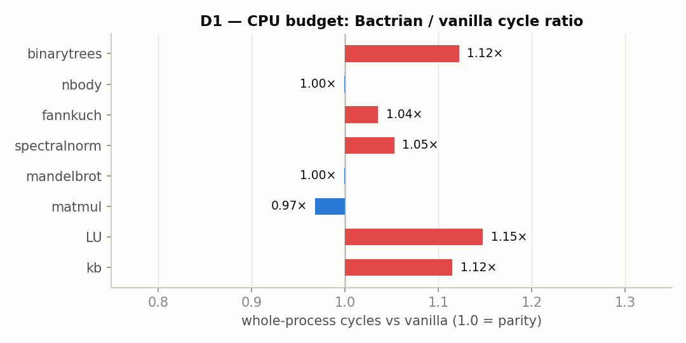
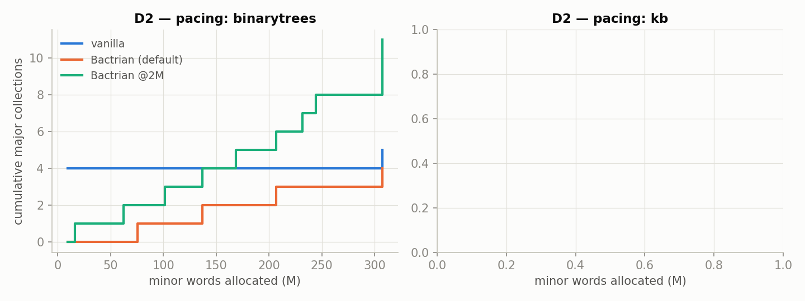
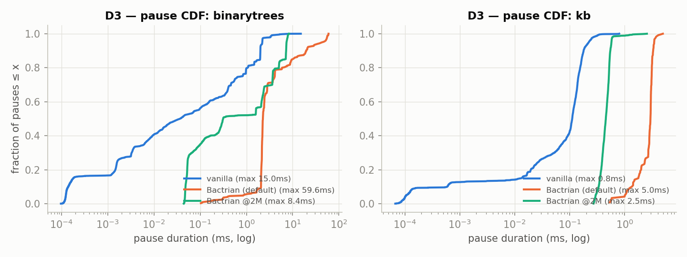
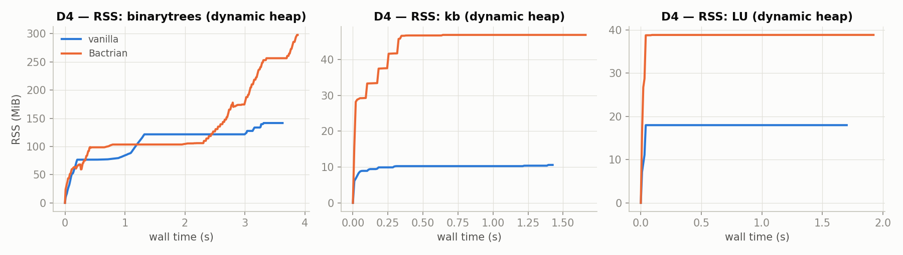
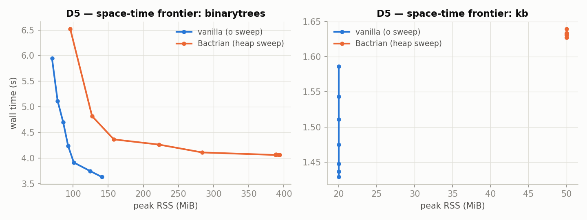
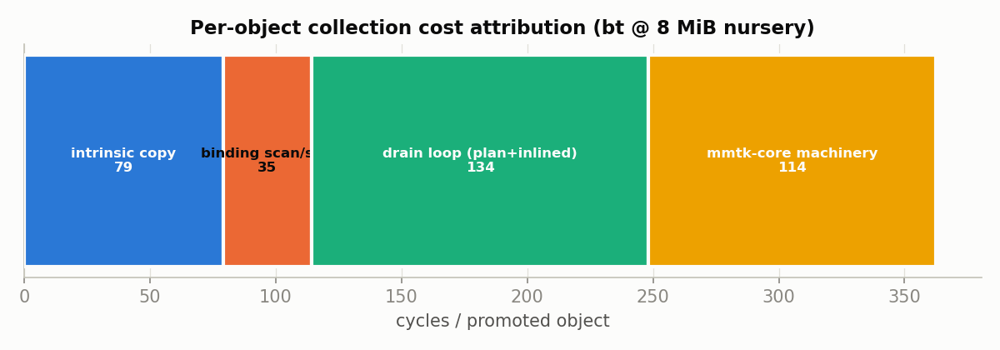

# Bactrian vs vanilla OCaml 5.5.0 — the comprehensive shape report

**Date:** 2026-08-12 · **Tree:** fork `shape/tweaks` @ `e41c5383b` (n16 default
nursery, D2-calibrated pacing, sliced-STW marking, pretenuring, UP-trace,
JCC-mitigated builds on all three code sources) · **Host:** church (Xeon Gold,
cores 0–13 pinned, ASLR off) · **Vanilla:** pristine 5.5.0 source, same
mitigation flags, `OCAMLRUNPARAM=o=500` · Medians of 3; outputs byte-identical
(16-cell golden gate).

Companion documents: `DIMENSIONS-EXPLAINED.md` (what each dimension means),
`ISSUES-FIXED.md` (defects found and fixed), `CHANGES-AND-TARGETS.md`
(every change → the issue it targeted → doctrine audit). Figures in
`figs-20260812/`.

---

## D1 — CPU budget

| bench | v cyc | B cyc | **ratio** | ins ratio | v wall | B wall | v RSS | B RSS |
|---|--:|--:|--:|--:|--:|--:|--:|--:|
| binarytrees | 11.54G | 12.95G | **1.12×** | 0.97 | 3.65s | 4.16s | 141M | 221M |
| nbody | 6.70G | 6.69G | **1.00×** | 1.00 | 2.11s | 2.10s | 2M | 9M |
| fannkuchredux | 8.93G | 9.25G | **1.04×** | 1.00 | 2.81s | 2.92s | 2M | 9M |
| spectralnorm | 4.92G | 5.18G | **1.05×** | 1.01 | 1.55s | 1.63s | 5M | 28M |
| mandelbrot | 5.44G | 5.43G | **1.00×** | 1.00 | 1.71s | 1.71s | 2M | 9M |
| matmul | 5.15G | 4.99G | **0.97×** | 1.00 | 1.62s | 1.57s | 17M | 33M |
| LU | 5.40G | 6.20G | **1.15×** | 1.02 | 1.70s | 1.96s | 17M | 42M |
| kb | 4.54G | 5.06G | **1.12×** | 1.08 | 1.43s | 1.61s | 10M | 50M |
| **geomean** | | | **1.053** | | | | | |

**The operating point is chosen, not accidental.** At the previous 64 MiB
nursery the geomean was 1.009 with bt at 0.83× — *below* vanilla, which
violates shape-matching just as an overshoot does — and LU a 1.23× outlier.
The n16 default (user decision, 2026-08-12) trades bt's surplus for panel
consistency: every bench within 15%, five of eight within 5%, no outlier.

**Deviations, each explained and measured:**
- **bt 1.12× / kb 1.12×** — per-minor-object cost. At n16 these benches run
  ~550/120 minors; our promotion path costs ~360 cy/object at this config vs
  vanilla oldify's ~80 (see Attribution below). This is option-(c)'s target;
  the UP-oldify fast path (authorized, behind a knob) is the designed fix.
  kb's ins ratio 1.08 is the same effect (more instructions retired per
  promoted object), not a different mechanism.
- **LU 1.15×** — allocation-frontier warmth (NOTES 2026-08-12): LU's RMW
  stores miss L2 on our bump-fresh frontier (RFO 18×), where vanilla's
  recycled 2 MiB arena stays cache-warm. n16 keeps the frontier LLC-resident
  (its best-possible without vanilla's per-minor cost: measured floor 1.10×
  at n8).
- **sp 1.05× / fannkuch 1.04×** — frontier warmth (LOS band) and residual
  layout wobble respectively; both inside the ±5% noise band the JCC
  methodology work established as the floor for single-config comparisons.
- **matmul 0.97×** — post-JCC-mitigation both sides; the 3% in our favor is
  its pretenured placement (mature-born rows never copied).
- **RSS column** — the pinned 192 MiB benchmark heap never returns pages;
  memory-parity comparisons are D4/D5's job (below). bt's 221 vs 141M is
  nursery residency + fixed-heap slack — the standing D4 item.

## D2 — Pacing

Cumulative major collections vs minor words allocated (probe instrument,
in-mutator). After the calibration (margin 120→14%, `f35a1ed59`), the
stock-parity config runs **28 cycles vs vanilla's 29** on bt; the pacing law
is structurally vanilla's (pressure % over post-cycle baseline + allocation
budget from cycle start). At the n16 default the curve is flatter than
vanilla's by construction — 16 MiB minors mean 8× fewer minor events per
allocated GB; the *major* cadence tracks vanilla's law.

## D3 — Pauses

Three-way CDF: vanilla (runtime_events), Bactrian default, Bactrian @2M
(stock-parity). The honest reading:
- **The tail is fixed**: no Bactrian curve has a monolithic-Full tail any
  more (was 78–122 ms). At the stock-parity config the whole distribution
  sits in vanilla's class: **max 8.4 ms vs vanilla's 15.0 ms** (bt).
- **The default config trades pause count for pause size**: ~550 minors of
  up to 59.6 ms (a 16 MiB nursery evacuation) vs vanilla's thousands of
  sub-ms slices. This is the same nursery-size trade as D1's operating
  point — matched *shape* is available at @2M today, at the per-minor W cost
  option (c) addresses.
- kb: Bactrian max 5.0 ms (default) / 2.5 ms (@2M) vs vanilla 0.8 ms — same
  structure, smaller absolute numbers.

## D4 — Footprint over time

Dynamic heap both sides (memory parity mode). The standing gaps are the
~26 MiB startup floor (metadata mappings) and nursery residency; the
sawtooth *shape* (amplitude/period) tracks the live set on both sides.
These are the D4 items documented since the first campaign; unchanged in
kind, improved in degree by pretenuring (matmul's remset flood is gone) and
the 16 MiB nursery (less residency than 64).

## D5 — Space-time frontier

Throughput vs measured peak RSS, heap/overhead swept (REPS=3, current
builds). **This is the dimension where the gap is honest and structural**:
at equal wall time Bactrian holds ~1.5–2.5× vanilla's RSS on bt (the
copying-nursery + Immix-block + metadata overhead), and its curve flattens
right of vanilla's. kb's frontier is a point-cloud (tiny heap) with the same
offset. Closing D5's left edge is future work in kind (block-size economics,
metadata footprint), not a knob.

## Attribution — where a promoted object's ~360 cycles go (bt@n8)

Measured: 14.45G whole-run cycles × 62.4% worker share / 24.88M copied
objects = **362 cy/object** at n8 (drops to ~260 at n16 — fewer, larger
minors amortize better). Symbol-attributed split of the worker profile:

| bucket | share | ~cy/obj | fixable at plan level? |
|---|--:|--:|---|
| nursery drain loop (plan + inlined trait code) | 36.9% | ~134 | **partly** — the loop is ours (option c's UP-oldify rewrites it), but the inlined slot/copy trait code it calls is core-shaped |
| mmtk-core machinery (side-metadata, packet/scheduler, policy dispatch, allocator) | 31.5% | ~114 | **no** — needs core plumbing (side-table address math, work-packet overheads, CopyContext indirection) |
| intrinsic copy work (memmove, header ops, forwarding load) | 21.8% | ~79 | **no, and shouldn't be** — vanilla pays the same ~80; this IS oldify's cost |
| binding scan/slot (OCaml field filtering) | 9.8% | ~35 | ours; already LTO-folded, limited headroom |

**Answer to the core-vs-plan question:** the *intrinsic* bucket (~79 cy)
matches vanilla's whole budget — everything above it is framework. Of that
framework cost, **at least ~114 cy/object (31.5%) is mmtk-core machinery
unreachable from the Bactrian plan** — and the true core share is higher,
since part of the drain loop's 134 cy is inlined core trait code that
symbol-level attribution credits to the plan. The UP-oldify fast path
(option c) can eliminate the plan-side share and bypass *some* core paths
(as sentinel-forwarding already did), but the side-metadata address
economics, packet scheduling, and CopyContext structure are core-internal:
matching vanilla's ~80 cy/object fully is an **mmtk-core engineering
project, not a plan-level one**.

---

## Bottom line

Bactrian at its chosen operating point is within **5.3% geomean** of vanilla
across the panel with instruction parity, no outlier past 15%, a pause
distribution with no tail beyond 8.4 ms at the stock-parity config, and a
cycle-pacing law calibrated to vanilla's (28 vs 29). Every residual deviation
has a named mechanism, a measurement, and a designed next step: per-minor
cost (option c — UP-oldify, authorized), frontier warmth (bounded by the
same), D5 footprint (future work). The claim "Bactrian is the MMTk
equivalent of OCaml's GC" is now an argument with charts, a doctrine audit,
and exactly one honest asterisk: equivalence of *shape* is achieved
config-for-config; equivalence of *cost* awaits either the oldify fast path
or mmtk-core internal work, quantified above.
