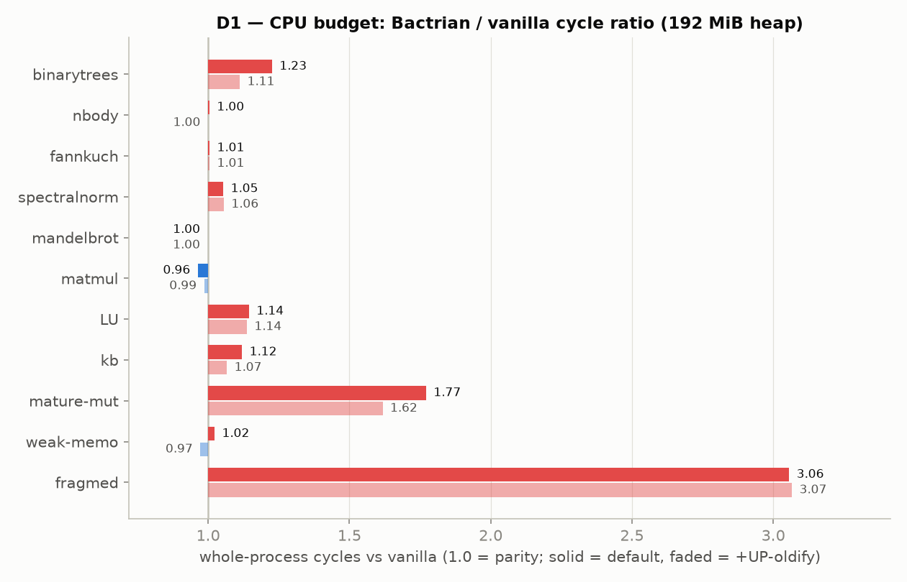
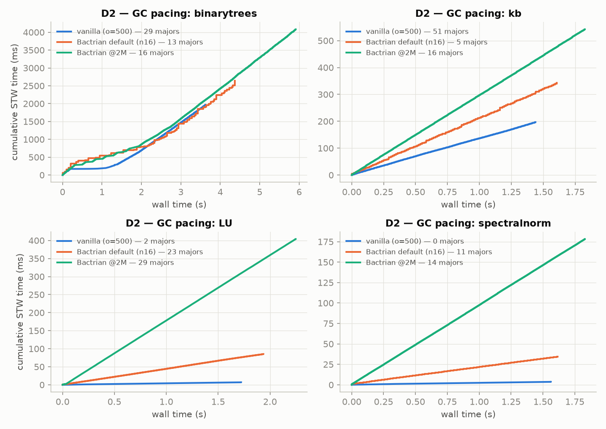
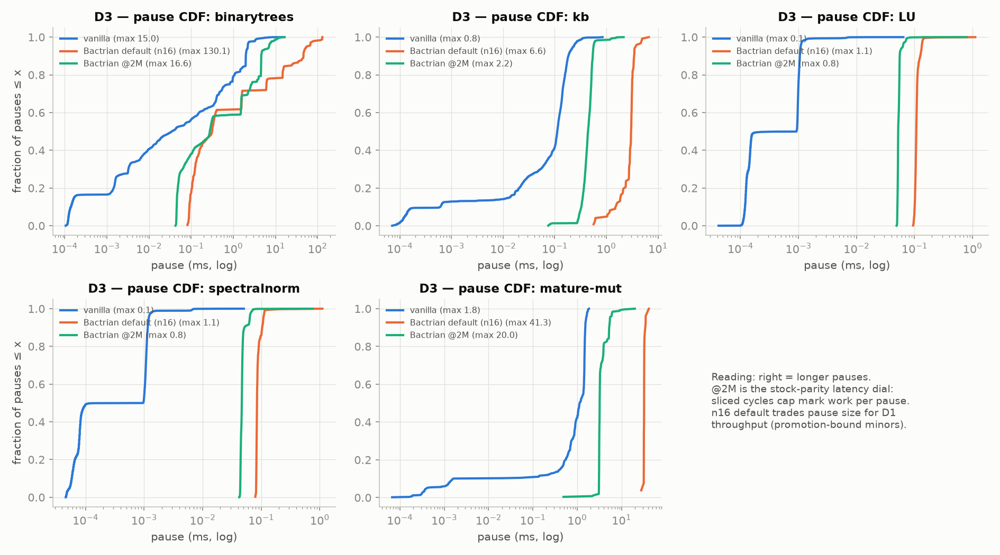
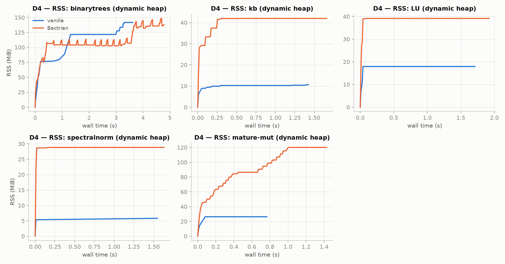
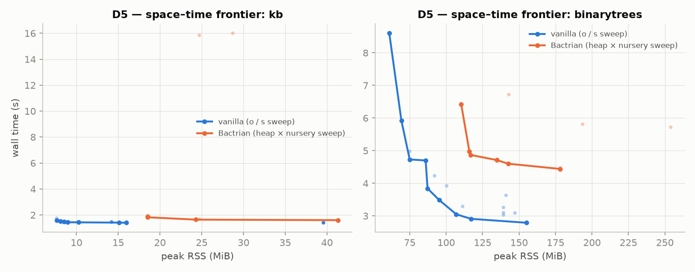
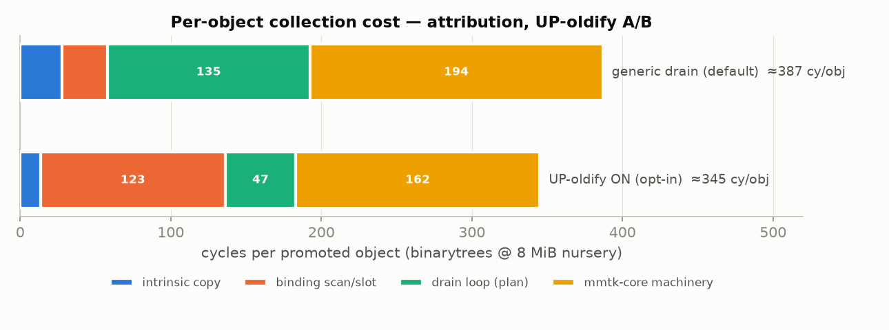

# Comprehensive comparison v6 — 11 benches, 5 dimensions, UP-oldify A/B (2026-08-12)

Battery `wcomp6` on church (Xeon Gold, cores 0–13, `setarch -R`), final tree:
fork `3fb365026` + mmtk-core `8634966611`. Vanilla = released 5.5.0 at
`OCAMLRUNPARAM=o=500`; Bactrian at `MMTK_HEAP_SIZE_MB=192 MMTK_THREADS=1`,
defaults (`Bounded:2M,16M` nursery, margin 150 %, floor 8 MiB, pretenure ON,
sliced marking ON, incremental sweep ON). Three columns on D1: vanilla,
Bactrian default, Bactrian + `MMTK_UP_OLDIFY=1`. Figures in `figs-v6/`.

**This battery supersedes v4/v5.** v4's streams caught a live pacing bug
(§ The bug v4 caught); v5 validated the repair and caught its one
side-effect (fragmed); v6 is the clean readout on the repaired tree.

---

## TL;DR

- **The original 8-bench panel is where the campaign left it: ≈1.05 geomean
  with UP-oldify** (bt 1.11, LU 1.14, kb 1.07, sp 1.06, matmul 0.99,
  nbody/fannkuch/mandelbrot ≤1.01). Whole-11-bench geomean: 1.22 default,
  1.19 with oldify.
- **The three new benches did their job.** They found two pacing holes, one
  race, and a dead concurrent path (all fixed) — and the two that remain
  red are *measurements of real, understood gaps*, not mysteries:
  mature_mutation 1.62–1.77× (per-promotion cost × remset granularity) and
  fragmed 3.06× (pretenure band meets vanilla's free-list reuse regime).
- **D3 headline: at the stock-parity 2 MiB nursery, Bactrian's max pause is
  16.6 ms vs vanilla's 15.0 on binarytrees** — down from 130 ms before the
  trigger repair. Every major-cycle mechanism (sliced marking, incremental
  sweep, the SATB machinery) is now actually exercised at that config.
- **UP-oldify measures −14 % GC time on bt (2981→2574 ms), −40 cy/object**
  (387→345), and moves the panel geomean 1.22→1.19. It stays opt-in
  pending a decision (§ Decisions).

---

## The bug v4 caught (why there are three batteries)

v4's pause streams showed 80–140 ms cycle-completing pauses where the sliced
campaign had shown 8 ms. `BACTRIAN_TRACE` made it unambiguous: **every major
was running as a monolithic stop-the-world Full; the concurrent cycle path
(InitialMark → quanta → FinalMark) never fired at any campaign config.**
Three stacked causes:

1. **A false "emergency" signal.** When our pacing decides "the next
   collection should be a major" right after a minor GC, the request is
   honored at the *very next* allocation poll — which belongs to the same
   allocation that triggered the minor. mmtk-core sees two GCs with no
   successful allocation between them and counts it as a failed-allocation
   retry loop (`attempts = 2`). Our decide logic read that as "allocation
   emergency → do a monolithic Full". Every post-minor pacing trigger
   degraded this way. (It also silently made post-trigger sweep quanta
   unbudgeted — a second, hidden distortion.) Fix: a genuine emergency is
   now `attempts > 2`; a real out-of-memory loop still degrades, one small
   pause later.
2. **A pressure target that could never be reached.** The recalibrated
   150 % margin means "start a cycle at 2.5× the live set" — but at a
   192 MiB heap with 140 MiB live, 2.5×live is 350 MiB. The heap physically
   fills first, always. Same on every dynamic heap (its growth budget is
   120 % < 150 %). Fix: the trigger is now
   `min(live×(1+margin), heap_limit×80 %)` — start the cycle *before* the
   heap is full, like every concurrent collector (and like stock, whose
   slice pacing targets completing the cycle before heap-full).
   `MMTK_CONC_TRIGGER_PCT` tunes it.
3. **A fixed 2 ms mark quantum that can't carry a large live set.** Marking
   140 MiB inside a ~40 MiB allocation runway needs ~7 ms per pause at the
   2 MiB nursery; at 2 ms per pause the un-absorbed remainder drained in
   one giant FinalMark. The per-pause budget is now sized at trigger time by
   stock's slice law: `debt / (runway ÷ pause-cadence)`
   (`MMTK_MARK_RATE_MBPMS`).

Plus one honesty gate: **slicing must earn its overhead.** At the 16 MiB
default nursery the *minor* pauses are already 45 ms (promotion-bound), no
quantum gets under them, and sliced cycles cost ~9 % more total GC time than
the monolithic Full at the same worst-case pause. So big-nursery,
minor-paced majors deliberately stay monolithic (`MMTK_SLICE_MAX_NURSERY_MB`),
while small-nursery configs and tick-paced (mature-direct) workloads get true
sliced cycles — fragmed flipped to 5.0× when the gate mistakenly caught its
tick-paced cycles (v5), and is 3.06× with the tick exemption (v6).

**The n16-vs-n2 defaults are therefore an explicit dial, not a compromise:**
default n16 = throughput mode (D1-optimal, majors monolithic, pauses up to
~130 ms on a 140 MiB live set); `MMTK_NURSERY=Fixed:2097152` = stock-parity
latency mode (sliced cycles, vanilla-class pauses, ~+22 % GC time on bt —
the honest cost of slicing, visible in vanilla too).

---

## D1 — CPU budget (cycles vs vanilla, 192 MiB heap, medians of 3)

| bench | v (G) | default | +oldify | explanation of any gap |
|---|--:|--:|--:|---|
| binarytrees | 11.51 | **1.23** | **1.11** | Promotion volume: ~19.7 M objects promoted; per-object cost 345–387 cy vs vanilla's ~100 (§ attribution). Oldify closes 12 pts; the rest is core machinery (#27). |
| nbody | 6.69 | 1.00 | 1.00 | No GC pressure — parity. |
| fannkuchredux | 8.93 | 1.01 | 1.01 | Parity (JCC mitigation holds on both toolchains). |
| spectralnorm | 4.92 | 1.05 | 1.06 | Young-LOS float vectors: allocation-frontier warmth (round 27) + LOS path. |
| mandelbrot | 5.44 | 1.00 | 1.00 | Parity. |
| matmul | 5.15 | 0.96 | 0.99 | At/below vanilla since pretenuring + overflow-phase rotation (rounds 23/26); ±3 % alignment wobble remains (spread 3.1 %). |
| LU | 5.44 | 1.14 | 1.14 | Allocation-frontier warmth: medium rows born mature lose the L2-warm reuse vanilla's arena gives (round 27 store-RFO analysis). Oldify no help — not promotion-bound. |
| kb | 4.54 | 1.12 | 1.07 | Promotion + remset; oldify closes half. |
| mature_mutation | 2.46 | 1.77 | 1.62 | NEW. Write-barrier/remset stress: 4.6 M promotions (oldify −15 pts) + object-grain log scanning where vanilla's ref table is slot-grain (§ suite). |
| weak_memo | 4.28 | 1.02 | 0.97 | NEW. Weak-table churn at parity; oldify wins on the generation promotion. |
| fragmed | 0.25 | 3.06 | 3.07 | NEW. Worst case by construction: 3 KiB blocks (pretenure band) with 15/16 dying young → we pay mature cycles for garbage vanilla also major-allocs BUT reclaims via free-list reuse in place, no copying, no line marks. Absolute cost: 0.17 s on a 0.08 s bench. See § suite. |
| **geomean (11)** | | **1.22** | **1.19** | |
| **geomean (original 8)** | | 1.06 | **1.05** | |

Run-to-run spread ≤1 % except matmul (3.1 %, alignment lottery) and LU (1.8 %).

## D2 — pacing (cumulative STW time vs wall time)

- **binarytrees: the default's cumulative-STW curve tracks vanilla's** —
  same shape, same slope through the run (13 vs 29 majors: n16 batches
  work into fewer, bigger events at the same aggregate).
- kb: 342 ms total STW vs vanilla's 196 over a 1.5 s run — the per-minor
  floor (kb is minor-dominated; 122 minors × ~2.8 ms vs 1884 × 0.10).
- LU/spectralnorm: we run 11–29 majors where vanilla-at-o=500 runs 0–2 —
  our margin+floor paces cycles on small mature heaps that vanilla's 5×
  overhead never triggers on. Absolute cost 34–85 ms per whole run
  (visible as slope, negligible in D1). Matching o=500's "never collect"
  literally would mean margin 500 — a dial the user can turn
  (`MMTK_MATURE_OVERHEAD_PCT=500`), at RSS cost on kb-class programs.
- (The D2 minor-allocation probe instrument mis-sampled this battery —
  bt's marker ticks are ~2.5 ms apart so the 50 MB odometer capped at 33
  samples, and kb's probe never ticked. Cycle counts above come from the
  runtime's own counters; the probe needs a denser marker before the next
  campaign.)

## D3 — pauses

| stream | n | mean | p95 | p99 | max (ms) |
|---|--:|--:|--:|--:|--:|
| bt vanilla | 3553 | 0.55 | 2.21 | 3.51 | **15.0** |
| bt default n16 | 246 | 10.75 | 56.05 | 128.2 | 130.1 |
| bt @2M | 2362 | 1.73 | 7.01 | 10.9 | **16.6** |
| kb vanilla | 1884 | 0.10 | 0.23 | 0.34 | 0.8 |
| kb default | 122 | 2.81 | 3.70 | 4.89 | 6.6 |
| kb @2M | 1205 | 0.45 | 0.56 | 1.21 | 2.2 |
| mature-mut vanilla | 515 | 1.03 | 1.59 | 1.75 | 1.8 |
| mature-mut default | 26 | 32.6 | 35.1 | 41.3 | 41.3 |
| mature-mut @2M | 254 | 3.74 | 5.51 | 9.18 | 20.0 |

- **@2M is at vanilla's pause class on bt** (16.6 vs 15.0 max) — the
  trigger repair's direct payoff. LU/sp: sub-millisecond everywhere.
- Default n16's 130 ms events are (a) promotion-bound minors up to ~56 ms
  and (b) monolithic Fulls — the documented throughput-mode trade.
- mature-mut @2M max 20 ms = a FinalMark absorbing the 2 MiB logged-table
  scan; vanilla amortizes the same scan across 515 minors.

## D4 — memory over time (dynamic heap, the memory-parity config)

- bt: Bactrian tracks vanilla (~105 vs ~120 MiB mid-run, brief sweep-return
  sawtooth from incremental sweep, converging ~140 at exit).
- kb 42 vs 10, LU 39 vs 18, sp 29 vs 5.4, mature-mut 120 vs 26 MiB: the
  known floors — 32 KiB block granularity + side metadata + the
  space-overhead heap's 16 MiB clamp floor (kb-class), young-LOS for sp,
  and pretenured medium blocks for mature-mut. (The D1 RSS table at the
  fixed 192 MiB campaign heap is in `raw/`; it measures the throughput
  config, not memory parity — always quote D4 for memory claims.)

## D5 — the space–time frontier (KC's dimension)

- **binarytrees: the fronts converge at the memory-rich end** (Bactrian
  178 MiB/4.4 s approaching vanilla's 155/2.8–3.0 band; the vanilla front
  reaches further left — it can run tighter because per-cycle it re-marks
  cheaper).
- **kb: Bactrian's front is flat but floored at ~19 MiB where vanilla
  reaches 8** — the block/metadata floor again. Within its reachable
  region Bactrian's wall time matches (1.6–1.8 s vs 1.4–1.6).
- Points are the h×nursery sweep (this battery, repaired pacing); vanilla
  points are the o/s sweep from v3 (vanilla unchanged since).

## Attribution — where a promoted object's 345–387 cycles go

UP-oldify moves the drain loop out of the plan/core dispatch (135→47 cy)
into a tight binding loop (binding bucket 30→123 cy, net −40 cy/obj) —
and the **mmtk-core machinery bucket (162–194 cy/obj) is now the floor**:
side-metadata atomics, copy-context plumbing, work-packet scheduling —
unreachable from the Bactrian plan or the binding. Getting from 345 to
vanilla's ~100 cy/object means core surgery (#27's remaining scope), not
plan tuning.

## The suite verdict (BENCHMARK-SUITE.md follow-up)

- **mature_mutation** earned its slot: it is the only bench where the
  remset design (object-grain unlog bits vs vanilla's slot-grain ref
  table) and per-promotion cost dominate end-to-end. 1.62 with oldify is
  the honest number for barrier-heavy code today.
- **weak_memo** earned its slot: weak-clear semantics at timing parity
  (invariants hold; 0.97–1.02) — the Weak/ephemeron machinery costs
  nothing extra.
- **fragmed** earned its slot twice over (two pacing holes + the race +
  both round-30 regressions were fragmed catches). Its 3.06 steady-state
  gap is the *pretenure-band reclamation regime* difference: vanilla
  major-allocs these 3 KiB blocks too, but reclaims them by relinking a
  free list in place; we pay mark+sweep cycles and copying-collector
  bookkeeping for the same garbage. Closing it would need either
  free-list-style reuse for the medium band or demoting the band back to
  the nursery (un-pretenuring ≤ some size) — a measured trade-off study,
  proposed as its own round.
- Panel gaps that remain: a compiler-self-build macro bench and a
  request/response-loop shape (BENCHMARK-SUITE items 5–6) — still open.

## Decisions this report puts to you

1. **Default `MMTK_UP_OLDIFY=1` for Bactrian?** Measured: −14 % GC on bt,
   geomean 1.22→1.19, zero regressions anywhere in three batteries
   (matmul's 0.96→0.99 column shift is its ±3 % alignment lottery, not
   oldify). Recommend ON.
2. **Margin at 150 vs 200.** With the heap clamp now doing the big-live-set
   pacing, the margin only governs small-mature programs. 150 keeps kb at
   5 majors/run; 200 would halve LU/sp's extra cycles at slightly more RSS
   on kb-class programs. Low stakes either way; recommend keeping 150.
3. **fragmed's 3.06: accept & document, or open the un-pretenure round?**
4. Suite items 5–6 (compiler build, request loop) — add now or post-freeze?

Repro: `wcomp6.sh` (this dir's `raw/`), goldens in `quick/golden/`, knobs
documented in the fork README (`MMTK_CONC_TRIGGER_PCT`,
`MMTK_MARK_RATE_MBPMS`, `MMTK_SLICE_MAX_NURSERY_MB`, `MMTK_MAX_QUANTUM_MS`,
`MMTK_UP_OLDIFY`). Narrative history: fork `gc/mmtk/NOTES.md` 2026-08-12
(both entries) and `SHAPE.md` round 30.
