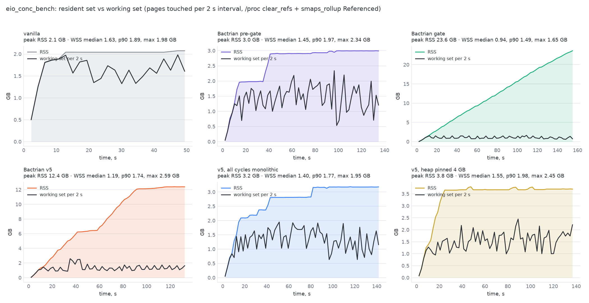

# eio under Bactrian: why the pacing blows up the resident set

*Investigative report, 2026-09-15 to 2026-09-19. Bench: `eio_conc_bench 9000`
(the macro-suite eio workload) on church (dual Xeon Gold 5120), node 0,
`setarch -R`, one GC worker, default dynamic heap and 16 MB nursery unless
stated. Binaries: vanilla 5.5.0 (f5238509d) and Bactrian in three states —
the tree before the slicing-gate rework ("pre-gate"), the gate as committed
(mmtk-core 50f56f5987, "gate"), and the uncommitted v5 candidate (gate +
inflow floor + projection guards). Raw data under `results/eio-rss/` and
`results/eio-wss/`; charts under `charts/`; runners `results/eio-rss/eio_rss.sh`
and `results/eio-wss/eio_wss.sh`; chart generator `eio_rss_charts.py`.*

## 1. Question

With the slicing gate, eio's wall time is unchanged (132 → 123–136 s) but its
peak resident set goes from 3.3 GB to 13–24 GB, against 2.1 GB under
vanilla. Is Bactrian keeping more data alive, is it failing to reclaim, or
is it being told to reclaim too late?

## 2. Hypothesis

It is being told to reclaim too late. Three pacing rules that are correct
for a monolithic Full collection are fed the wrong "live" size while a
sliced major cycle is in flight, and they compound:

- **H1.** The dynamic heap limit is recomputed after every minor as
  2.2 × reserved. During a sliced cycle nothing is reclaimed, so the limit
  rises in step with the heap and never exerts pressure.
- **H2.** At the end of a sliced cycle the limit is set from the *unswept*
  size (the sweep is deferred into per-minor slices), so it is 2.2 × (live +
  garbage + objects promoted during the cycle).
- **H3.** The deferred sweep runs a fixed 2 ms per minor; on a multi-GB
  mature space it takes hundreds of minors, and no new cycle may start until
  it finishes, while promotion continues.
- **H4.** The binding's cycle-start law measures the old generation against a
  baseline taken after the sweep, which still contains every object promoted
  during the previous cycle (born black, never checked), and waits for 2 to
  2.5 × that.

Each step lengthens the next cycle, which enlarges the next baseline, which
lengthens the next gap. Under monolithic Fulls none of this occurs: the
sweep is inside the pause, reserved-after-GC is the true live set, and the
same rules produce vanilla-like sizing.

## 3. What was measured

| experiment | what | how |
|---|---|---|
| E1 | RSS over time, vanilla / pre-gate / gate / v5 | `ps` RSS every 0.5 s, pause log aligned (`eio_rss.sh`) |
| E2 | one knob at a time on the v5 binary | same sampler; `BACTRIAN_NO_CONCURRENT=1`, `MMTK_HEAP_SIZE_MB=4096`, `MMTK_NURSERY=Fixed:2 MiB`, `MMTK_MATURE_OVERHEAD_PCT=50`; earlier: `MMTK_MARK_RATE_MBPMS=0.1` |
| E3 | what the heap trigger sees | instrumented v5 build printing at every pause: reserved pages (the trigger's "live"), immix / LOS / non-moving / nursery reserved, the heap limit, sweep-pending (`patch_trace_spaces.py`, `BACTRIAN_TRACE=1`) |
| E4 | working set vs resident set | per 2 s interval: `Referenced` from `/proc/PID/smaps_rollup` after clearing the referenced bits via `/proc/PID/clear_refs` (`eio_wss.sh`) — pages the program actually touched in the interval, independent of what the allocator keeps resident |
| reference | vanilla's own accounting | `OCAMLRUNPARAM=v=0x400`: `top_heap_words` 263.5 M words = 2.1 GB peak major heap; at space_overhead 120 that is a peak live set of about 1 GB; `promoted_words` / `minor_words` = 85 % survival |

## 4. Observations

**O1 — the shape of the growth (E1).** Vanilla rises to 2.1 GB in 10 s and
stays flat. Pre-gate Bactrian rises to 2.9 GB and stays flat, with a Full
every 40–135 minors. Gate rises linearly at ~0.17 GB/s for the whole run
(one sliced cycle that never finished; 23.5 GB). v5 rises in ramps separated
by short plateaus and ends at 15.8 GB; the plateaus are the sweep windows.


**O2 — the knobs (E2).** Same binary (v5), one change each:

| knob | peak RSS | cycles | wall |
|---|---:|---:|---:|
| none | 15.8–16.1 GB | 11 | 123 s |
| every cycle monolithic | **2.8 GB** | 35 | 135 s |
| heap pinned at 4 GB | **3.8 GB** | 16 | 126 s |
| 2 MB nursery | 5.9 GB | 21 | 180 s |
| margin 50 % instead of 150 % | 9.7 GB | 16 | 131 s |
| 10× mark budget (gate binary) | 5.4 GB | 16 | 117 s |

Two of these are decisive. Pinning the limit at 4 GB removes H1 and H2 and
the run completes normally, 16 cycles, no allocation failures, same wall
time: the collector keeps up as soon as the limit stops moving. Forcing
every cycle monolithic removes H1–H4 at once and reproduces the pre-gate
2.8 GB. The nursery and margin knobs only scale the excursion.


**O3 — the limit follows the heap (E3, H1).** At every pause the heap limit
equals 2.2 × reserved to within rounding: 1811 = 824 × 2.2, 3103 = 1410 ×
2.2, 17571 = 7987 × 2.2, 34253 = 15569 × 2.2 MB. During cycle 2 (276
minors) reserved went 4.0 → 8.0 GB and the limit 8.7 → 17.6 GB in lockstep.
Source: `SpaceOverheadTrigger::on_gc_end` in mmtk-core's `gc_trigger.rs`
does `current_heap_pages.fetch_max(reserved × (1 + overhead))` for every
non-full GC.

**O4 — the limit is set from the unswept size (E3, H2).** At FinalMark of
cycle 2 reserved was 8.0 GB and the limit was stored as 17.6 GB. The sweep
that followed freed pages down to 7.5 GB, but the limit stayed at 17.4 GB.
The trigger takes FinalMark as a full GC (`last_collection_full_heap`
includes it) and reads reserved before the deferred sweep has run.

**O5 — the sweep blocks the next cycle for a long time (E3, H3).** Sweep
windows after the three FinalMarks: 18, 146 and 432+ minors (the third was
still draining at exit). During the 146-minor window promotion added about
2 GB; during the 432-minor window about 6 GB. No cycle can start while
`sweep_pending` is set. An earlier note in this campaign that "the sweep
drains in ~17 slices" was true only of the first, 1.4 GB, cycle.

**O6 — the baseline keeps the black-born pages (H4).** Trigger state at
each cycle decision (from `[pace] trigger` lines): baseline 0.40 → 1.66 →
2.76 → 6.1 GB; cycle starts at 1.0, 4.6, 8.0, 12.1 GB; gaps of 31, 208,
345, 759 minors. Pages promoted during the previous cycle: 0.44, 0.6,
2.8 GB. Every baseline is the previous swept size, which includes those.

**O7 — freed pages stay resident.** After the last sweep reserved fell from
15.6 to 7.4 GB while RSS stayed at 15 GB: MMTk keeps freed pages in its page
resource. Peak RSS is therefore peak reserved, and peak reserved is set by
O3–O6.


**O8 — working set vs resident set (E4).** See §5.

## 5. Working set

Working set = pages the process touched in each 2 s interval (`Referenced`
in `smaps_rollup` after clearing the referenced bits), sampled through the
whole run; RSS from the same file. This is what the program and the
collector *use*; RSS is what the allocator *holds*.

| variant | peak RSS | WSS median (2 s) | WSS p90 | WSS max |
|---|---:|---:|---:|---:|
| vanilla | 2.1 GB | 1.63 GB | 1.89 GB | 1.98 GB |
| Bactrian pre-gate | 3.0 GB | 1.45 GB | 1.97 GB | 2.34 GB |
| Bactrian gate | 23.6 GB | 0.94 GB | 1.49 GB | 1.65 GB |
| Bactrian v5 | 12.4 GB | 1.19 GB | 1.74 GB | 2.59 GB |
| v5, all cycles monolithic | 3.2 GB | 1.40 GB | 1.77 GB | 1.95 GB |
| v5, heap pinned 4 GB | 3.8 GB | 1.55 GB | 1.98 GB | 2.45 GB |



- **The working set is 1–2.6 GB in every variant**, including the gate run
  whose RSS reaches 24 GB. Nothing touches the other 10–22 GB: it is
  promoted-and-dead memory waiting for a cycle, plus the black-born pile,
  resident only because nobody reclaimed it and freed pages are never
  returned.
- The medians say what the workload needs: about 1.2–1.7 GB. Vanilla's 1.67
  GB is the highest median because its collector re-touches the whole 2 GB
  heap 103 times (marking and sweeping are part of the working set); the
  gate run's 0.96 GB is the lowest because its one sliced cycle touches
  little per interval.
- Peak WSS tracks the collector's activity, not RSS: 2.0 GB (vanilla), 2.4
  (pre-gate), 1.7 (gate), 2.7 (v5), 2.0 (monolithic), 2.5 (pinned).
- So the RSS excursion is not a larger live set or a larger working set. It
  is the same ~1 GB of live data plus a growing volume of untouched dead
  memory that the pacing has not yet asked the collector to reclaim.


## 6. Reading the observations together

The collector's own work is not the problem: marking completes (v4/v5), the
sweep completes, throughput is unchanged, and when the limit is pinned the
same collector holds 3.8 GB with no trouble. What breaks is the *accounting
that drives the pacing*, in one place: "reserved pages right after a GC" is
used as the live size by both the core heap trigger and the binding's
cycle-start law, and under a sliced cycle that quantity is live + garbage +
black-born promotion, re-read every minor while it only grows.

The chain, once more, in order: no reclamation inside a cycle (by design)
→ the limit rises with the heap (O3) → no pressure, so cycles run long and
promote gigabytes (O1) → the end-of-cycle limit is 2.2 × the unswept pile
(O4) → the sweep takes hundreds of minors and blocks the next cycle (O5) →
the baseline is the swept size including black-born pages, and the start
law waits for 2–2.5 × it (O6) → the next cycle starts later and runs longer
→ repeat. Freed pages never leave the process (O7), so every excursion is
permanent in RSS.

Vanilla is immune by construction: its heap target is 2.2 × live measured
after the sweep, its sweep is paced by allocation and finishes with the
cycle, and its per-slice work is proportional to what was promoted.

## 7. Levers (for the fix discussion; nothing applied)

1. **What "live" means for the heap trigger during and after a sliced
   cycle.** Options: freeze the limit at the cycle's InitialMark size while
   the cycle and its sweep are in flight; resize only when the sweep has
   drained; subtract the pages born black during the cycle (mature at
   FinalMark − mature at InitialMark, already tracked); or use the marked
   bytes from the mark phase instead of reserved pages.
2. **Sweep pacing.** The 2 ms fixed slice was tuned at a 192 MB heap. A
   floor proportional to promotion since the last slice (as the v4 mark
   floor does for marking), or an unbudgeted drain once a cycle request is
   pending, bounds O5.
3. **The binding baseline.** Same black-born subtraction when the swept
   baseline is noted, so promotion during a cycle counts toward the next
   trigger instead of raising its bar.
4. **Returning freed pages** (O7) is separate from pacing and would lower
   RSS after the fact rather than prevent the excursion.

## 8. Reproducing

```
scp results/eio-rss/eio_rss.sh results/eio-wss/eio_wss.sh church:shape/
ssh church 'CORES=0-13 bash ~/shape/eio_rss.sh ~/shape/eio-rss/e1 vanilla:vanilla pregate:gate-before gate:gate-after v5:gate-rule1v5'
ssh church 'CORES=14-27 bash ~/shape/eio_rss.sh ~/shape/eio-rss/e2 nc:gate-rule1v5:BACTRIAN_NO_CONCURRENT=1 heap4g:gate-rule1v5:MMTK_HEAP_SIZE_MB=4096 nur2:gate-rule1v5:MMTK_NURSERY=Fixed:2097152 ov50:gate-rule1v5:MMTK_MATURE_OVERHEAD_PCT=50'
ssh church 'CORES=0-13 bash ~/shape/eio_rss.sh ~/shape/eio-rss/e3 "v5dbg:gate-rule1v5dbg:BACTRIAN_TRACE=1 MMTK_PACE_DEBUG=1"'
ssh church 'INTERVAL=2 CORES=0-13 bash ~/shape/eio_wss.sh ~/shape/eio-wss vanilla:vanilla pregate:gate-before gate:gate-after v5:gate-rule1v5 nc:gate-rule1v5:BACTRIAN_NO_CONCURRENT=1 heap4g:gate-rule1v5:MMTK_HEAP_SIZE_MB=4096'
python3 eio_rss_charts.py results/eio-rss charts
```
The instrumented binary is the v5 tree plus `results/eio-rss/patch_trace_spaces.py`
(a print in `trace_pause`); the macro binaries are the ones under
`~/shape/macro/gate-*` on church.
