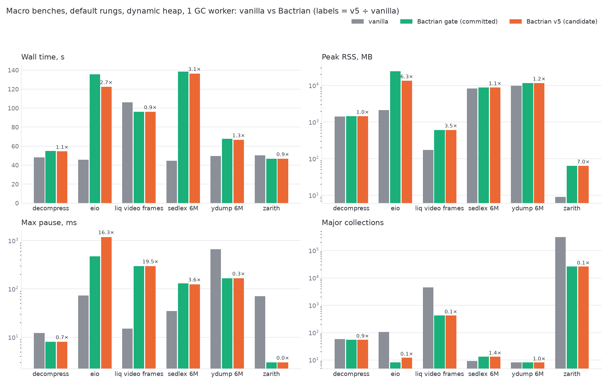
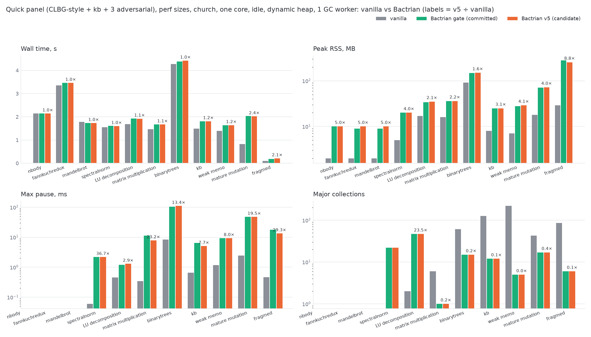
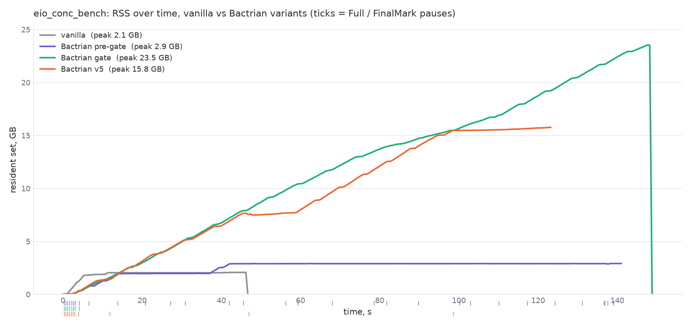
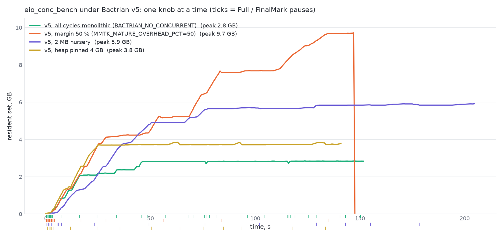
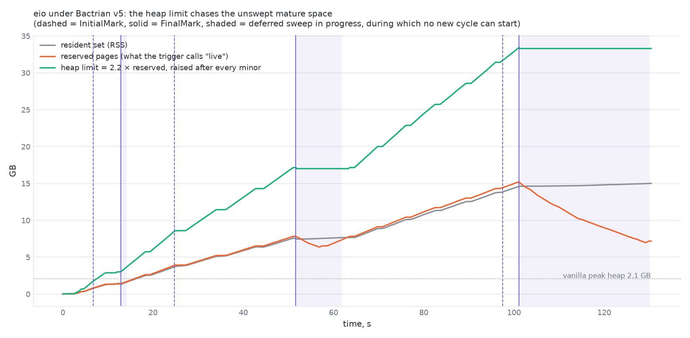

# sedlex under Bactrian: three discriminating experiments

Church, dual Xeon Gold 5120, runs pinned to one socket, `MMTK_THREADS=1`,
Bactrian at a pinned 8 GiB heap unless noted, vanilla at `o=500`. Binaries:
`~/shape/macro/{mmtk,vanilla}/sedlex/sedlex_bench.exe` (fix-branch build of
2026-08-30) and a probed build (`mmtk-probe3`) carrying the counters and
busy-wait hooks described in §5. Perf counters were locked (`paranoid=4`), so
every number is wall-clock, `MMTK_VERBOSE`, `MMTK_PAUSE_LOG`, `Gc.stat`, or
OCaml runtime events (`olly trace`). Reproduce with `sedlex_experiments.sh`;
charts with `sedlex_charts.py` (see §7).

## 0. Question and answer

Is sedlex's ~6x slowdown a remembered-set cost, a promotion (minor-to-major
copy) cost, or something else?

**Not the remembered set — it is empty.** Bactrian's per-GC remset counters
read `modbuf_objs=0`, `satb_nodes=0` at every nursery collection, and a
constant 1940 region entries over the entire run at every n and nursery size;
vanilla's `minor_remembered_set` phase totals 1–3 ms across n = 0.5M–2M.
sedlex is pure functional consing (young → old pointers), which the barrier
never logs.

**Promotion is real, and it is a quarter of the gap — and within it the copy
itself is ~10%: the per-object tracing path around the copy is the cost (§4a).** The dominant term (61%) is eleven cadence-triggered full re-marks
of a growing live set: a pacing law, not a copy cost. Mutator is the rest.

| component (n=1M) | vanilla | Bactrian | share of the 35.6 s gap |
|---|---:|---:|---:|
| promotion (vanilla `minor_local_roots_promote` / Bactrian nursery pauses) | 2.08 s | 11.55 s | 27% |
| major work (vanilla 3685 slices / Bactrian 11 monolithic fulls) | 0.56 s | 22.36 s | 61% |
| mutator | 4.31 s | ~8.8 s | 13% |
| wall | 7.09 s | 42.7 s | |


## 1. The workload

`sedlex_bench.ml` generates a ~480 MB pseudo-code string and tokenizes it into
ONE monotonically growing list of tens of millions of boxed tokens (most
holding a fresh `lexeme` string), then `List.rev`, `List.length`, `List.iter`.
Nothing dies young; the live set only grows; there are no mutations of old
objects. It is the canonical generational-hypothesis violator.

## 2. Experiment A — nursery-size sweep (long-lived vs short-lived)

Prediction: a promotion-bound long-lived workload is nursery-size-invariant
(the copy volume is the live set, whatever the nursery), while a short-lived
workload speeds up with a bigger nursery (more objects die before promotion).


All five series share one axis with wall time in seconds on a log scale, so
equal ratios are equal vertical distances and both workloads keep their true
shape (colour = runtime, line style = workload). The two short-lived (dashed)
binarytrees series fall by 2.7x (Bactrian, 10.0 -> 3.7 s) and 1.35x (vanilla,
3.9 -> 2.9 s) by 64 MB; vanilla sedlex is flat at 7.1 s; Bactrian sedlex with
the backstop off moves only 30 -> 22 s over a 128x range of nursery sizes. The
default Bactrian sedlex line's spike to 45.6 s at 8 MB is the
sliced-to-monolithic regime switch (7 -> 11 fulls), i.e. pacing, and
disappears with the backstop off.

sedlex n=1M, wall (s):

| nursery | 2 MB | 4 MB | 8 MB | 16 MB | 64 MB | 256 MB |
|---|---:|---:|---:|---:|---:|---:|
| vanilla (`s=`) | 7.1 | 7.1 | 7.1 | 7.1 | 7.1 | 7.1 |
| Bactrian, backstop off | 30.2 | 28.1 | 31.3 | 26.8 | 21.4 | 22.6 |
| Bactrian, default | 31.3 | 29.2 | 45.6 | 41.2 | 35.7 | 30.3 |

Bactrian's copy volume is invariant (62–63.5M objects at every nursery). The
backstop-off row is flat within the fixed per-pause overhead; the default row's
8 MB spike is the sliced→monolithic regime switch (7 → 11 fulls), i.e. pacing.

binarytrees n=20 (control), wall (s) and objects copied / promoted words:

| nursery | 2 MB | 4 MB | 8 MB | 16 MB | 64 MB |
|---|---:|---:|---:|---:|---:|
| Bactrian | 10.0 (40.2M) | 9.8 (37.4M) | 6.8 (25.0M) | 5.8 (19.9M) | 3.7 (4.4M) |
| vanilla | 3.9 (137M w) | 3.6 (115M w) | 3.3 (91M w) | 3.3 (72M w) | 2.9 (26M w) |

The control behaves exactly as a short-lived workload should on both runtimes.
sedlex does not. This is the promotion-bound signature.

## 3. Experiment B — remembered-set size vs n and vs nursery size

Probed build, `MMTK_REMSET_DEBUG=1`, one line per GC:

| n | nursery | nursery GCs | modbuf objects (total) | region entries (total) | SATB nodes |
|---|---|---:|---:|---:|---:|
| 0.5M | 2 / 16 / 256 MB | 2448 / 252 / 20 | 0 / 0 / 0 | 1940 / 1940 / 1940 | 0 |
| 1M | 2 / 16 / 256 MB | 4920 / 502 / 39 | 0 / 0 / 0 | 1940 / 1940 / 1940 | 0 |
| 2M | 2 / 16 / 256 MB | 9959 / 1010 / 73 | 0 / 0 / 0 | 1940 / 1941 / 1940 | 0 / 1 / 0 |

The remembered set does not grow with n, does not depend on nursery size, and
is four to five orders of magnitude below the objects promoted (31.4M / 63.5M / 127.4M in total at 0.5M / 1M / 2M, i.e. 65K–10.7M per GC depending on nursery).
The 1940 region entries are the `Buffer` used to build the input, written
once. Vanilla agrees: `minor_remembered_set` 0.001 / 0.002 / 0.003 s at
0.5M / 1M / 2M against 1.09 / 2.07 / 4.38 s of promotion.


## 4. Experiment C — per-stage cost measured directly, and stage coloring

### 4a. Direct per-stage cycles (rdtsc inside the probes)

The probed build times every stage invocation with `rdtsc` (constant-rate
TSC, 2.195 GHz on this Xeon; the timer's own cost, 89 ticks per begin/end
pair, is calibrated at startup and subtracted). Per-stage totals are
accumulated in the collector and printed at exit under `MMTK_STAGE_CYCLES=1`.
Nothing here is derived from wall time or from the pause log; the pause-log
class totals appear only as an independent cross-check. Nesting: `scan_object`
times the whole per-object path in the drain (scan the object, trace each
slot, write back), which *contains* the `object_copy` timer (the copy itself
plus the forwarding-pointer install); the pause timers (`prepare` →
`end_of_gc`) contain everything.


n=1M, backstop default (backstop off in parentheses):

| stage | invocations | corrected ticks / call | seconds | pause-log cross-check |
|---|---:|---:|---:|---:|
| `full_pause` | 10 (3) | 4.9 G (5.2 G) | **22.35** (7.15) | 22.36 (6.85) |
| `nursery_pause` | 490 (490) | 69.5 M = 31.6 ms | **15.52** (15.29) | 11.55 (11.42)† |
| `scan_object` — per-object trace path, includes copy | 63.46M | **310** (306) | 8.97 (8.83) | — |
| `object_copy` — copy + forwarding install only | 63.47M | **30** (29) | 0.87 (0.84) | — |
| `cycle_pause` / `mark_quantum` / `sweep_quantum` / `modbuf_object` | 2 / 2 / 1 / 0 | — | ≈0 | — |

† the pause log records the STW window; the `prepare`→`end_of_gc` timer also
covers the pre-/post-pause work the plan does around it (nursery reset, release,
bookkeeping), which is why the direct figure is the larger of the two.

Three things this establishes, none of which the wall-time attribution could:

1. **The full re-marks are 22.35 s by direct count.** The pause log's 22.36 s
   is now a confirmation, not an input.
2. **Inside promotion, the copy itself is ~10%.** Copy + forwarding costs
   30 ticks (~14 ns) per object. The other ~280 ticks per object are the
   scan-and-trace machinery around it: reading each slot, `trace_object`
   dispatch, forwarding and mark-bit checks, the slot write-back. The cost is
   the per-object *tracing path*, not the memcpy.
3. **~42% of nursery-pause time is outside the per-object loop**: 15.5 s of
   pauses vs 9.0 s of per-object work leaves ~6.5 s, i.e. ~13 ms of fixed
   cost per pause (root scanning, nursery reset, pause setup/teardown, worker
   hand-off). That is what a larger nursery amortises — the 256 MB nursery's
   −30% in §5 is this term.

For comparison, vanilla's own per-phase timer (runtime events,
`minor_local_roots_promote`) puts its promotion of the same 63.5M objects at
2.08 s, i.e. ~33 ns or ~72 TSC ticks per object, against Bactrian's 310 on the
per-object path — about 4.3x per object, before Bactrian's ~13 ms per-pause
fixed cost is counted.

At n=2M the per-object trace cost creeps from 310 to 326 ticks as the heap
grows (cache), and the per-full cost from 2.2 s to 3.2 s with the live set;
the structure is unchanged.

### 4b. Stage coloring by busy-wait injection (independent invocation counts)

`MMTK_SPIN_STAGE=<stage> MMTK_SPIN_NS=<ns>` spins for `ns` at every
invocation of one stage and nothing else. If a stage runs N times, adding d
seconds per invocation adds N·d to wall time, whatever the stage itself costs.
So the slope of wall time against the injected delay is the invocation count
N, obtained without any timer in the collector.

What this can and cannot establish. Coloring measures *how often* a stage
runs, not *how long* it runs: the shift is N·d whether the stage's own cost
is 10 ns or 10 s. Turning N into seconds needs the per-invocation cost, and
that is exactly the quantity §4a measures directly with `rdtsc`. (An earlier
draft divided the pause-log totals by N to get a "cost per invocation"; that
uses the wall-time attribution to prove itself and was dropped.) So the
ranking of stages comes from §4a; coloring's job is to confirm, by a method
that shares nothing with the probes, the counts that §4a's totals rest on.

The raw comparison, n=1M, backstop default (the backstop-off series is in
`results/coloring2.txt` and `results/coloring_objcopy.txt`). "No injection"
is the same binary with `MMTK_SPIN_STAGE` unset, run in the same batch;
run-to-run noise on this workload is about ±1 s.

| stage | delay per call | wall, no injection | wall, with injection | Δ | N = Δ/delay | N, slope fit | probe counter |
|---|---:|---:|---:|---:|---:|---:|---:|
| `nursery_pause` | 10 ms | 42.29 s | 44.82 s | +2.53 s | 253 | 485 | 490 |
| | 20 ms | | 49.36 s | +7.07 s | 354 | | |
| | 40 ms | | 59.32 s | +17.03 s | 426 | | |
| `full_pause` | 0.5 s | 42.29 s | 47.42 s | +5.13 s | 10.3 | 10 | 10 |
| | 1.0 s | | 52.51 s | +10.22 s | 10.2 | | |
| `cycle_pause` | 0.5 s | 42.29 s | 43.45 s | +1.16 s | 2.3 | 2 | 2 |
| `scan_object` | 100 ns | 42.29 s | 50.41 s | +8.12 s | 81 M | 60.7 M | 63.5 M |
| | 200 ns | | 59.13 s | +16.84 s | 84 M | | |
| | 400 ns | | 69.14 s | +26.85 s | 67 M | | |
| `object_copy` | 100 ns | 42.87 s | 51.23 s | +8.36 s | 84 M | 66.2 M | 63.5 M |
| | 200 ns | | 58.87 s | +16.00 s | 80 M | | |
| | 400 ns | | 71.28 s | +28.41 s | 71 M | | |
| `mark_quantum` | 1 ms / 4 ms | 42.29 s | 42.65 / 43.37 s | +0.36 / +1.08 s | within noise | ≈0 | 2 |
| `sweep_quantum` | 1 ms / 4 ms | 42.29 s | 42.88 / 40.79 s | +0.59 / −1.50 s | within noise | ≈0 | 1 |
| `modbuf_object` | 1 ms | 42.29 s | 42.84 s | +0.55 s | within noise | ≈0 | 0 |

Reading it: the per-point ratio Δ/delay is biased when Δ is close to the
±1 s noise floor (the 10 ms nursery point) and, for the sub-microsecond
stages, by the spin loop's own ~30–50 ns entry cost, which the slope between
adjacent points removes: between the 20 ms and 40 ms nursery points the
slope is 498 (probe: 490); between the two full-pause points 10.2 (probe:
10). The fitted N agrees with the probe counters within 1% for pauses and
within ~5–10% for the ~63 M per-object stages. The stages the counters say
never run (`modbuf_object`, the quanta) show no slope at all.

Combined with §4a this closes the loop: the counts are right by two
independent methods, and the per-invocation costs are measured directly, so
the stage totals (full re-marks 22.35 s, nursery pauses 15.5 s of which
9.0 s is the per-object trace and 0.87 s the copy, everything else ≈0) are
not inferred from wall time anywhere.


## 5. What moves the number (measured, n=1M)

Full pacing diagnosis (trigger trace, cadence and margin-law sweeps, stacked
knobs, CLBG spot-check) in
[PACING-DIAGNOSIS.md](PACING-DIAGNOSIS.md).

| change | wall | vs vanilla | mechanism |
|---|---:|---:|---|
| default | 42.7 s | 6.0x | |
| `MMTK_FULL_GC_CADENCE=100000` (bytes backstop off) | 26.8 s | 3.8x | fulls 11 → 4 |
| + nursery 256 MB + UP-oldify | 20.1 s | 2.72x | fewer pauses, plain-op copy |
| Immix (non-moving), `overhead=500` | 8.1 s | 1.16x | copies nothing; 3–4x RSS |

The bytes backstop (`collection.rs`, a full every 512 MiB of nursery
allocation, blind to survivors and headroom) is the pacer: `MMTK_PACE_DEBUG`
shows 10/11 fulls `by_cadence`; the margin law (`MMTK_MATURE_OVERHEAD_PCT`
100–1000%) leaves the count at 11. Disabling it also makes binarytrees faster
(5.32 → 4.88 s, 13 → 8 fulls, RSS unchanged) at a pinned heap; the
dynamic-heap case is unchecked. Beyond pacing, the promotion copy itself is
the architectural cost; StickyImmix (in-place young marking) is the fix and
currently panics under the native binding (`epilogue.rs:11`).

### Landed: the slicing gate rework (mmtk-core 50f56f5987, binding e4af0d336)

The old feasibility gate (`MMTK_SLICE_MAX_NURSERY_MB`=4, `MMTK_MAX_QUANTUM_MS`=50,
plus a redundant 200 ms quantum ceiling) is replaced by two measured tests:
slice iff the monolithic Full would be too long (`debt_ms` = live / mark-rate
> `MMTK_SLICE_WORTH_MS`, default 200) AND the sliced pause would fit
(nursery-pause EWMA + quantum <= `MMTK_SLICE_MAX_PAUSE_MS`, default 100).
`MMTK_PACE_DEBUG` prints each decision.

| bench (1 worker) | before | after |
|---|---|---|
| sedlex 1M, 8 GiB | 40.7 s, 11 fulls, max pause 6.3 s, GC 32.5 s | **22.6 s**, 6 fulls, max pause **1.4 s**, GC 14.2 s |
| sedlex 2M, 8 GiB | 80.5 s, 15 fulls, max pause 10.9 s | **42.4 s**, 8 fulls, max pause **1.1 s** |
| binarytrees n16, 192 MiB | 5.76 s, 13 fulls, max 118 ms | 5.59 s, 13 fulls, max 114 ms (unchanged; debt never exceeds ~28 ms) |

Full 11-bench quick panel, before vs after, 3 reps: wall geomean 0.993 (T=1)
and 0.989 (T=4), RSS unchanged, GC/full counts identical, pause maxima within
noise, golden outputs 33/33 in all four batteries. No CLBG bench reaches a
200 ms Full estimate, so the panel takes the old path exactly; only
large-live-set workloads take the new one. Residual: sedlex's max pause is
~1.1-1.4 s, not tens of ms -- a few early cycles the gate judged short
(debt < 200 ms at the default 1 MB/ms mark rate) ran longer; a lower
`MMTK_SLICE_WORTH_MS` is the tuning follow-up.

### Macro panel, before vs after the gate (default rungs, dynamic heap, 1 worker)

Six runnable macro benches, built from one tree that differs only in the
gate, run on church node 0 at their default rungs with the **default dynamic
heap** and the default 16 MB nursery: wall = median of 3, RSS = peak over the
3, pause stream from a fourth run (`macro_gate.sh`; raw lines in
`results/macro-gate/panel.log`, gate decisions in
`results/macro-gate/gate-decisions.*.log`).

| bench | wall before → after | peak RSS | fulls | GC time | max pause |
|---|---:|---:|---:|---:|---:|
| decompress | 53.6 → 55.0 s (+2.7%) | 1.32 → 1.45 GB | 54 → 54 | 2.1 → 2.4 s | 33 → 8 ms |
| eio_conc | 132.5 → 135.6 s (+2.3%) | **3.3 → 24.1 GB** | 31 → 8 | 86.3 → 72.3 s | 1.85 s → 470 ms |
| liq_video_frames | 100.4 → 96.2 s (−4%) | 0.61 → 0.61 GB | 417 → 417 | 58.0 → 54.5 s | 301 → 295 ms |
| sedlex 6M | 281.1 → **138.4 s** (−51%) | 8.4 → 8.7 GB | 20 → 13 | 227 → 89.6 s | **40.1 s → 131 ms** |
| ydump 6M | 85.6 → **67.7 s** (−21%) | 9.2 → 11.6 GB | 10 → 8 | 46.1 → 29.7 s | **13.9 s → 166 ms** |
| zarith_pi | 46.8 → 46.8 s | 69 → 63 MB | 25618 → 25617 | 17.8 → 17.6 s | 3 → 3 ms |

Wall geomean 0.855. liq and zarith never reach the 200 ms worth bar and are
unchanged; decompress slices its ~30 ms Fulls at a small RSS cost. On the
pinned 8 GB heap sedlex's RSS is unchanged by the gate (1435 → 1438 MB at 1M,
2866 → 2868 MB at 2M; `results/macro-gate/sedlex_pinned_rss.log`).

**eio exposes a latent livelock in the slice-sizing law, not in the gate.**
Eight of eio's nine cycles were judged not worth slicing (debt 6–130 MB) and
ran as monolithic Fulls exactly as before; the ninth (debt 341 MB) was sliced
and never finished (`gate-decisions.eio.log`, `quantum-hints.eio.sampled.log`):

- a sliced cycle ends only when the parked marking queue drains
  (`marking_queue_drained`), and every mid-cycle minor pushes new marking
  work for the objects it promotes (`schedule_marking_packet`);
- each mid-cycle minor drains one quantum, whose length the binding
  re-derives at **every** minor (the trigger stays armed until a full
  completes) as debt ÷ pauses with pauses = (heap − mature) ÷ nursery;
- under the dynamic heap, heap grows while the cycle is open and nothing is
  reclaimed, so the planned pause count rose 66 → 1871 and the quantum fell
  to its 2 ms floor while the queue kept growing;
- eio promotes ~281 k objects per minor; at the measured ~310 ticks per
  scanned object that is ~40 ms of new marking per minor against a 2–5 ms
  quantum. The queue can never empty: no FinalMark, no reclamation, no new
  cycle, heap → 30 GB.

sedlex and ydump show the same overrun without the fatal form (their inflow
is below the drain): sliced cycles ran 3–6× their planned pauses (sedlex's
last: planned 221, ran >1136, runway 3.5 → 11 GB; ydump's last: planned 416,
ran 631), which is ydump's +27% RSS. The old gate never sliced at a 16 MB
nursery, so the law was unexercised.

Fix direction (not yet applied): pace marking by promotion, not by runway —
the quantum must at least cover what this minor promoted (promoted bytes ÷
mark rate, stock OCaml's law), hinted once at cycle start rather than
re-derived against a growing heap; plus an overrun guard that runs the next
quantum unbudgeted when a cycle exceeds a multiple of its planned pauses or
mature has outgrown the runway it started with. Until then the gate rework
should not be the default on the dynamic heap.

### Rule 1 iterations on eio (2026-09-11, evening): inflow floor, projection guards, and the baseline ratchet

All raw files under `results/macro-gate/rule1/`; the code as a diff against
mmtk-core 50f56f5987 in `rule1-v5.diff` (uncommitted; applied via
`patch_quota{2,3,4,5}.py`). Bench config as the macro panel above.

| eio, default rung | before gate | gate | v4: inflow floor | v5: + projection guards |
|---|---:|---:|---:|---:|
| wall (median of 3) | 132.5 s | 135.6 s | **117.7 s** | 122.5 s |
| peak RSS | 3.3 GB | 24.1 GB | 13.8 GB | 13.4 GB |
| major cycles | 31 Fulls | 8 Fulls + 1 sliced (never finished) | 8 + 2 sliced (finished) | 8 + 4 sliced (finished) |
| max pause | 1.85 s | 470 ms | 542 ms | 1.18 s (one guard escalation) |

ydump, sedlex and decompress are identical across gate / v4 / v5 (67 s /
11.6 GB, 137 s / 8.7 GB, 55 s / 1.4 GB); binarytrees n16 at 192 MB pinned is
unchanged by the guards (11 pauses, max 17 ms, golden n20 OK).

What each step established:

- **v1–v3 measured zero and are no-ops, not refutations.** Promotion adds no
  marking work (promoted objects are born black under SATB), and SATB records
  are parked as `ProcessModBufSATB` packets that only reach the enqueued
  counter when they execute inside a quantum, after the quota is read.
- **v4 — inflow floor.** The quantum first traces at least the SATB records
  made since the previous quantum (`SATB_ENQ`, counted at enqueue time, plus
  nursery seeds), then runs its time budget. Sum, not max: a max only holds
  the queue steady. Result: every sliced cycle drains; eio RSS 24 → 13.8 GB.
- **v5 — projection guards.** After each budgeted quantum: backlog ÷ net
  objects per slice (EWMA) vs runway ÷ promotion per minor (EWMA); if the
  cycle would not finish inside the runway, the next quantum runs unbudgeted
  (a Full cannot start mid-cycle). The same on the sweep. eio: one mark
  escalation (need 197 minors vs 178), sweep never (drains in ~17 slices, so
  the earlier sweep-wait hypothesis was wrong).
- **The 10× budget control** (`MMTK_MARK_RATE_MBPMS=0.1`, ~50 ms quanta, old
  gate-after binary): all cycles drain, RSS 5.4 GB, wall 117 s — the work is
  finite; RSS is set by how long cycles and the gaps between them run.

**Why RSS stays at 13 GB after v4/v5: the baseline ratchet.** The binding
starts a cycle at baseline × 2.5 (margin law, `MMTK_MATURE_OVERHEAD_PCT`
150, clamped to 80 % of the heap) or after max(512 MiB, 2 × baseline) of
nursery allocation (cadence backstop), where baseline = mature after the
previous cycle's sweep. After a monolithic Full the baseline is the true
live set. After a sliced cycle it also contains everything promoted while
the cycle was open: born black, never tested, kept by the sweep. v5 eio
timeline (trigger state at each decision):

| cycle | mature at start | baseline used | fired by | minors since previous cycle | promoted in gap |
|---|---:|---:|---|---:|---:|
| A | 1.0 GB | 0.40 GB | margin | 31 | 0.7 GB |
| B | 4.6 GB | 1.66 GB | cadence, 3.3 GB allocated | 208 | 2.9 GB |
| C | 8.0 GB | 2.76 GB | cadence, 5.5 GB allocated | 345 | 4.8 GB |
| D | 12.1 GB | 6.1 GB | cadence, 12.1 GB allocated | 759 | 10.6 GB |

Black allocation per cycle: 0.44, 0.6, 2.8 GB. The gap laws multiply the
inflated baseline, the longer gap promotes more, the next cycle runs longer
and bakes in more — the baseline doubles per cycle.

**Proposed v6 (not applied):** when the swept baseline is noted after a
sliced cycle, subtract the pages born black during it (mature at FinalMark −
mature at InitialMark, already tracked in core): those promotions count
toward the next trigger instead of raising its bar. One trait accessor in
core, one subtraction in the binding.

### Macro benches: Bactrian vs vanilla (2026-09-14)

Six macro benches at their default rungs, church node 0, `setarch -R`,
single GC worker, default dynamic heap and 16 MB nursery for Bactrian;
stock defaults for vanilla. Bactrian columns: the tree before the slicing
gate, the gate as committed (mmtk-core 50f56f5987), and the v5 candidate
(inflow floor + projection guards, `results/macro-gate/rule1/rule1-v5.diff`),
all measured 2026-09-11 on an idle machine. Vanilla: one panel on the idle
machine on 2026-09-14 (`vanilla_panel.sh`, `results/macro-gate/vanilla/`):
wall ×3 and RSS, minor/major counts from `OCAMLRUNPARAM=v=0x400`, GC time
and max pause from `olly gc-stats` (its latency profile; a vanilla "pause"
is a minor plus the major slice attached to it). Its walls reproduce the
2026-08-30 idle panel within 1 %. (Another user's 17-core job held church
from 2026-09-12 19:27 to 2026-09-14 17:38; runs taken under it were
discarded.) Table generator: `macro_compare.py`.



**Wall time (median of 3)**

| bench | vanilla | Bactrian pre-gate | Bactrian gate (committed) | Bactrian v5 (candidate) | v5 ÷ vanilla |
|---|---:|---:|---:|---:|---:|
| decompress | 48.2 s | 53.5 s | 55.0 s | 54.5 s | 1.13× |
| eio | 45.8 s | 132.5 s | 135.6 s | 122.5 s | 2.68× |
| liq video frames | 106.0 s | 100.4 s | 96.2 s | 96.2 s† | 0.91× |
| sedlex 6M | 44.5 s | 281.1 s | 138.4 s | 136.5 s | 3.06× |
| ydump 6M | 49.6 s | 85.6 s | 67.7 s | 66.7 s | 1.34× |
| zarith | 50.4 s | 46.8 s | 46.8 s | 46.8 s† | 0.93× |

**Peak RSS (max over the 3 timed runs)**

| bench | vanilla | Bactrian pre-gate | Bactrian gate (committed) | Bactrian v5 (candidate) | v5 ÷ vanilla |
|---|---:|---:|---:|---:|---:|
| decompress | 1.4 GB | 1.3 GB | 1.4 GB | 1.4 GB | 1.02× |
| eio | 2.1 GB | 3.2 GB | 23.6 GB | 13.1 GB | 6.30× |
| liq video frames | 174 MB | 607 MB | 607 MB | 607 MB† | 3.49× |
| sedlex 6M | 8.1 GB | 8.2 GB | 8.5 GB | 8.5 GB | 1.05× |
| ydump 6M | 9.6 GB | 9.0 GB | 11.3 GB | 11.3 GB | 1.18× |
| zarith | 9 MB | 69 MB | 63 MB | 63 MB† | 7.00× |

**Max pause**

| bench | vanilla | Bactrian pre-gate | Bactrian gate (committed) | Bactrian v5 (candidate) | v5 ÷ vanilla |
|---|---:|---:|---:|---:|---:|
| decompress | 12 ms | 33 ms | 8 ms | 8 ms | 0.65× |
| eio | 72 ms | 1.9 s | 470 ms | 1.2 s | 16.29× |
| liq video frames | 15 ms | 301 ms | 295 ms | 295 ms† | 19.55× |
| sedlex 6M | 35 ms | 40.1 s | 131 ms | 124 ms | 3.59× |
| ydump 6M | 657 ms | 13.9 s | 166 ms | 165 ms | 0.25× |
| zarith | 71 ms | 3 ms | 3 ms | 3 ms† | 0.04× |

Bactrian: longest STW window in the pause log (nursery, Full, sliced-cycle pause). Vanilla: `olly gc-stats` latency profile max (a minor plus its attached major slice).

**Major collections**

| bench | vanilla | Bactrian pre-gate | Bactrian gate (committed) | Bactrian v5 (candidate) | v5 ÷ vanilla |
|---|---:|---:|---:|---:|---:|
| decompress | 57 | 54 | 54 | 54 | 0.95× |
| eio | 103 | 31 | 8 | 12 | 0.12× |
| liq video frames | 4,413 | 417 | 417 | 417† | 0.09× |
| sedlex 6M | 9 | 20 | 13 | 13 | 1.44× |
| ydump 6M | 8 | 10 | 8 | 8 | 1.00× |
| zarith | 309,418 | 25,618 | 25,617 | 25,617† | 0.08× |

Bactrian: Fulls plus completed sliced cycles. Vanilla: `major_collections` from `OCAMLRUNPARAM=v=0x400`.

**Minor collections**

| bench | vanilla | Bactrian pre-gate | Bactrian gate (committed) | Bactrian v5 (candidate) | v5 ÷ vanilla |
|---|---:|---:|---:|---:|---:|
| decompress | 11,867 | 1,673 | 1,882 | 1,882 | 0.16× |
| eio | 13,194 | 1,828 | 1,829 | 1,833 | 0.14× |
| liq video frames | 8,826 | 2,502 | 2,502 | 2,502† | 0.28× |
| sedlex 6M | 22,744 | 3,034 | 3,046 | 3,046 | 0.13× |
| ydump 6M | 10,729 | 1,433 | 1,444 | 1,444 | 0.13× |
| zarith | 618,846 | 51,284 | 51,284 | 51,284† | 0.08× |

**GC time**

| bench | vanilla | Bactrian pre-gate | Bactrian gate (committed) | Bactrian v5 (candidate) | v5 ÷ vanilla |
|---|---:|---:|---:|---:|---:|
| decompress | 0.4 s | 2.1 s | 2.4 s | 2.4 s | 6.36× |
| eio | 29.4 s | 86.3 s | 72.3 s | 68.4 s | 2.33× |
| liq video frames | 61.8 s | 58.0 s | 54.5 s | 54.5 s† | 0.88× |
| sedlex 6M | 18.7 s | 227.0 s | 89.6 s | 88.0 s | 4.71× |
| ydump 6M | 13.8 s | 46.1 s | 29.7 s | 29.5 s | 2.13× |
| zarith | 6.5 s | 17.8 s | 17.6 s | 17.6 s† | 2.73× |

Bactrian: sum of STW time (`MMTK_VERBOSE`). Vanilla: `olly gc-stats` GC time (minor + major, incl. slices).

† not rerun under v5: no sliced cycle occurs on this bench, so it is identical to the gate binary by construction.

Reading it:

- **Throughput.** Bactrian is within 0.9–1.15× of vanilla on decompress, liq
  and zarith, 1.35× on ydump, and 2.7–3.1× on eio and sedlex. The two slow
  ones are the promotion-bound workloads (§4a: 310 ticks per promoted
  object vs vanilla's ~72), not pacing any more: the gate removed the
  multi-second Fulls and halved sedlex's wall.
- **Peak RSS.** Within 1.2× of vanilla on decompress, sedlex and ydump. eio
  is the open problem (6.3× under v5, the baseline ratchet described
  above; vanilla holds 2.1 GB with 103 majors). liq (3.5×) and zarith (7×)
  are small absolute numbers (607 MB / 63 MB) from block/chunk granularity
  and LOS accounting.
- **Max pause.** Vanilla's incremental major keeps its worst pause at 12–72
  ms on five benches; its one large pause is ydump (657 ms, a major slice
  over the 10 GB live set), where Bactrian's sliced cycle is better (166 ms).
  Bactrian's worst pauses after the gate are 8 ms (decompress), 131–166 ms
  (sedlex, ydump), 295 ms (liq: its LOS-pressure Fulls) and 0.5–1.2 s on eio
  (the v5 guard escalation). Before the gate they were 14–40 s.
- **GC time.** Vanilla spends 29 s (64 %) of eio and 62 s (58 %) of liq in
  GC — these workloads are GC-heavy under any collector. Bactrian's GC time
  is 2.1–2.3× vanilla on eio/ydump, 4.7× on sedlex (promotion), 0.9× on
  liq, and 6× on decompress from a small base (2.4 s vs 0.4 s).
- **Cycle counts.** Vanilla runs an order of magnitude more majors on liq
  (4413) and zarith (309k, one per two minors) because its major work is
  paced by large-value allocation; Bactrian's 417 / 25.6k Fulls are the
  LOS-pressure ticks. On sedlex/ydump the counts match (8–13 vs 8–9). On eio
  vanilla's 103 cycles vs Bactrian's 12 is the RSS story again. Minors
  differ 6–8× from the 2 MB minor heap vs the 16 MB nursery.

### Quick panel (CLBG-style + kb + 3 adversarial): Bactrian vs vanilla (2026-09-14)

The 11-bench quick panel (seven CLBG/sandmark sequential benches, kb, and
the three adversarial programs weak_memo / mature_mutation / fragmed) at
perf sizes, vanilla vs Bactrian gate (committed) vs Bactrian v5 (candidate),
on church (Xeon Gold 5120) once the machine was idle: one core, `setarch -R`,
dynamic heap, one GC worker. **Interleaved**: for each bench, five rounds of
vanilla, gate, v5 back-to-back; wall is the median of 5 (min–max spreads
under 2 %). Golden outputs byte-identical on all 33 cells. Instrumentation as
in the macro table. Runner: `results/quick-vs-vanilla/church/quick_interleaved_church.sh`;
generator: `quick_compare.py`.

**All three sides are built in one environment** (the laptop: same GCC 15.2,
same ld 2.46, vanilla from the vanilla-5.5.0 switch at release 5.5.0
f5238509d, the fork from the installed mmtk-5.5). This matters: a vanilla
fannkuchredux built on church on 2026-08-12 from the *same commit, same
configure flags, same GCC and same source* runs 2.83 s on church, where the
laptop-built one runs 3.35 s and the fork's 3.45 s — an 18 % swing on a
no-allocation, no-GC loop from object layout (the binaries differ by 12 KB
ahead of the benchmark code, which shifts the hot loop's alignment). A
comparison mixing builds from the two environments would attribute that to
the collector. The run against the Aug-12 church vanilla natives is kept in
`results/quick-vs-vanilla/church-idle-aug12vanilla.log` for the record.



**Wall time (median of 3)**

| bench | vanilla | Bactrian gate (committed) | Bactrian v5 (candidate) | v5 ÷ vanilla |
|---|---:|---:|---:|---:|
| nbody | 2.1 s | 2.1 s | 2.1 s | 1.00× |
| fannkuchredux | 3.4 s | 3.5 s | 3.5 s | 1.03× |
| mandelbrot | 1.8 s | 1.7 s | 1.7 s | 0.97× |
| spectralnorm | 1.6 s | 1.6 s | 1.6 s | 1.03× |
| LU decomposition | 1.7 s | 1.9 s | 1.9 s | 1.14× |
| matrix multiplication | 1.5 s | 1.7 s | 1.7 s | 1.14× |
| binarytrees | 4.3 s | 4.4 s | 4.4 s | 1.04× |
| kb | 1.5 s | 1.8 s | 1.8 s | 1.21× |
| weak memo | 1.4 s | 1.6 s | 1.6 s | 1.17× |
| mature mutation | 0.8 s | 2.0 s | 2.0 s | 2.43× |
| fragmed | 0.1 s | 0.2 s | 0.2 s | 2.10× |

**Peak RSS (max over the 3 timed runs)**

| bench | vanilla | Bactrian gate (committed) | Bactrian v5 (candidate) | v5 ÷ vanilla |
|---|---:|---:|---:|---:|
| nbody | 2 MB | 10 MB | 10 MB | 5.00× |
| fannkuchredux | 2 MB | 9 MB | 10 MB | 5.00× |
| mandelbrot | 2 MB | 9 MB | 10 MB | 5.00× |
| spectralnorm | 5 MB | 20 MB | 20 MB | 4.00× |
| LU decomposition | 17 MB | 34 MB | 35 MB | 2.06× |
| matrix multiplication | 16 MB | 36 MB | 36 MB | 2.25× |
| binarytrees | 92 MB | 149 MB | 150 MB | 1.63× |
| kb | 8 MB | 25 MB | 25 MB | 3.12× |
| weak memo | 7 MB | 28 MB | 29 MB | 4.14× |
| mature mutation | 18 MB | 71 MB | 72 MB | 4.00× |
| fragmed | 29 MB | 280 MB | 255 MB | 8.79× |

**Max pause**

| bench | vanilla | Bactrian gate (committed) | Bactrian v5 (candidate) | v5 ÷ vanilla |
|---|---:|---:|---:|---:|
| nbody | 0 ms | 0 ms | 0 ms | ? |
| fannkuchredux | 0 ms | 0 ms | 0 ms | ? |
| mandelbrot | 0 ms | 0 ms | 0 ms | ? |
| spectralnorm | 0 ms | 2 ms | 2 ms | 36.67× |
| LU decomposition | 0 ms | 1 ms | 1 ms | 2.89× |
| matrix multiplication | 0 ms | 11 ms | 8 ms | 23.24× |
| binarytrees | 8 ms | 104 ms | 111 ms | 13.36× |
| kb | 1 ms | 6 ms | 5 ms | 7.73× |
| weak memo | 1 ms | 9 ms | 9 ms | 8.03× |
| mature mutation | 2 ms | 48 ms | 48 ms | 19.51× |
| fragmed | 0 ms | 18 ms | 14 ms | 29.35× |

Bactrian: longest STW window in the pause log. Vanilla: `olly gc-stats` latency profile max.

**Major collections**

| bench | vanilla | Bactrian gate (committed) | Bactrian v5 (candidate) | v5 ÷ vanilla |
|---|---:|---:|---:|---:|
| nbody | 0 | 0 | 0 | ? |
| fannkuchredux | 0 | 0 | 0 | ? |
| mandelbrot | 0 | 0 | 0 | ? |
| spectralnorm | 0 | 22 | 22 | ? |
| LU decomposition | 2 | 47 | 47 | 23.50× |
| matrix multiplication | 6 | 1 | 1 | 0.17× |
| binarytrees | 61 | 15 | 15 | 0.25× |
| kb | 126 | 12 | 12 | 0.10× |
| weak memo | 220 | 5 | 5 | 0.02× |
| mature mutation | 43 | 17 | 17 | 0.40× |
| fragmed | 86 | 6 | 6 | 0.07× |

Bactrian: Fulls plus completed sliced cycles. Vanilla: `major_collections` from `OCAMLRUNPARAM=v=0x400`.

**Minor collections**

| bench | vanilla | Bactrian gate (committed) | Bactrian v5 (candidate) | v5 ÷ vanilla |
|---|---:|---:|---:|---:|
| nbody | 0 | 0 | 0 | ? |
| fannkuchredux | 0 | 0 | 0 | ? |
| mandelbrot | 0 | 0 | 0 | ? |
| spectralnorm | 2,746 | 732 | 732 | 0.27× |
| LU decomposition | 5,587 | 1,489 | 1,489 | 0.27× |
| matrix multiplication | 12 | 3 | 2 | 0.17× |
| binarytrees | 1,778 | 244 | 244 | 0.14× |
| kb | 942 | 234 | 234 | 0.25× |
| weak memo | 607 | 132 | 132 | 0.22× |
| mature mutation | 255 | 44 | 44 | 0.17× |
| fragmed | 172 | 24 | 20 | 0.12× |

**GC time**

| bench | vanilla | Bactrian gate (committed) | Bactrian v5 (candidate) | v5 ÷ vanilla |
|---|---:|---:|---:|---:|
| nbody | 0.0 s | 0.0 s | 0.0 s | ? |
| fannkuchredux | 0.0 s | 0.0 s | 0.0 s | ? |
| mandelbrot | 0.0 s | 0.0 s | 0.0 s | ? |
| spectralnorm | 0.0 s | 0.1 s | 0.1 s | 6.00× |
| LU decomposition | 0.0 s | 0.1 s | 0.1 s | 11.50× |
| matrix multiplication | 0.0 s | 0.0 s | 0.0 s | ? |
| binarytrees | 2.6 s | 2.7 s | 2.8 s | 1.08× |
| kb | 0.2 s | 0.4 s | 0.4 s | 1.66× |
| weak memo | 0.4 s | 0.8 s | 0.8 s | 1.73× |
| mature mutation | 0.6 s | 1.7 s | 1.7 s | 2.68× |
| fragmed | 0.1 s | 0.1 s | 0.1 s | 1.22× |

Bactrian: sum of STW time (`MMTK_VERBOSE`). Vanilla: `olly gc-stats` GC time (minor + major, incl. slices).

Reading it:

- **Throughput.** The compute-bound CLBG benches are at parity (nbody 1.00×,
  fannkuchredux 1.03×, mandelbrot 0.97×, spectralnorm 1.03×); the
  allocation-light numeric ones pay ~14 % (LU_decomposition,
  matrix_multiplication); binarytrees 1.04×, weak_memo 1.17×, kb 1.21×. The
  two designed adversaries are where Bactrian loses: mature_mutation 2.4×
  (mature write traffic through the object-grain remembered set) and fragmed
  2.1× (fragmentation churn). gate and v5 agree within noise everywhere, as
  expected: no quick bench reaches the 200 ms worth bar, so no cycle is
  sliced.
- **Peak RSS.** MMTk's fixed footprint (metadata, chunk reservation) shows
  as 9–10 MB vs 2 MB on the no-GC benches; on the GC-active ones Bactrian
  sits at 1.6–4× vanilla, fragmed at 9× (256–283 MB vs 29 MB).
- **Max pause.** Vanilla's pauses are 0.1–8 ms at these sizes (2 MB minor
  heap, incremental major); Bactrian's maxima are its Fulls: 104–111 ms on
  binarytrees, 48 ms on mature_mutation, 14–18 ms on fragmed, 8–11 ms on
  matrix_multiplication.
- **Majors / minors.** Vanilla runs 2–40× more major cycles (allocation-paced
  slices) than Bactrian runs Fulls, and 3–7× more minors (2 MB vs 16 MB).

Laptop cross-check (Core Ultra 7 265H, one P-core, interleaved, same
binaries; `results/quick-vs-vanilla/panel.log`, `charts/quick_vs_vanilla.png`):
the ratios agree with church within a few percent except mature_mutation
(2.8× on the laptop vs 2.4× on church) and fragmed (3.0× vs 2.1×), the two
benches whose cost is memory-system bound. Non-interleaved laptop passes and
the church run taken under another user's 17-core job are under
`results/quick-vs-vanilla/discarded/` with the reasons.

### What causes the eio RSS blowup under Bactrian (2026-09-15)

Standalone investigative report with the working-set measurement: [EIO-RSS-PACING.md](EIO-RSS-PACING.md).


Three experiments on the idle church (`results/eio-rss/`, runner
`eio_rss.sh`, charts `eio_rss_charts.py`): RSS sampled every 0.5 s with the
pause log aligned (E1: vanilla, pre-gate, gate, v5), one knob at a time on
the v5 binary (E2), and an instrumented v5 run that prints at every pause
what the heap trigger takes as live, the per-space reserved pages, the heap
limit and the sweep state (E3, `patch_trace_spaces.py`). Vanilla's own exit
statistics put its peak major heap at 2.1 GB (`top_heap_words`), i.e. a
peak live set near 1 GB at space_overhead 120.



| E2: v5 with one knob | peak RSS | cycles | wall | note |
|---|---:|---:|---:|---|
| v5 as is | 15.8–16.1 GB | 11 | 123 s | |
| every cycle monolithic (`BACTRIAN_NO_CONCURRENT=1`) | **2.8 GB** | 35 | 135 s | pre-gate behaviour |
| heap pinned at 4 GB (`MMTK_HEAP_SIZE_MB=4096`) | **3.8 GB** | 16 | 126 s | no OOM, no thrash: the collector keeps up when the limit cannot move |
| 2 MB nursery (vanilla parity) | 5.9 GB | 21 | 180 s | 17.5k minors, 120 s GC |
| margin 50 % instead of 150 % | 9.7 GB | 16 | 131 s | |
| 10× mark budget (`MMTK_MARK_RATE_MBPMS=0.1`, gate binary) | 5.4 GB | 16 | 117 s | from the earlier run |



**The causal chain, with the numbers from the instrumented run:**

| pause | event | reserved (unswept mature) | heap limit | what follows |
|---:|---|---:|---:|---|
| 224 | InitialMark, cycle 1 | 0.8 GB | 1.8 GB | 46 minors of slices; reserved → 1.4 GB, limit → 3.1 GB |
| 270 | FinalMark | 1.4 GB | 3.1 GB | sweep drains after 18 minors → reserved 1.7 GB, limit 3.8 GB |
| 435 | InitialMark, cycle 2 | 4.0 GB | 8.7 GB | 276 minors; reserved → 8.0 GB, limit → 17.6 GB |
| 711 | FinalMark | 8.0 GB | 17.6 GB | sweep drains after **146 minors** → reserved 7.5 GB |
| 1356 | InitialMark, cycle 3 | 14.8 GB | 32.5 GB | 49 minors |
| 1405 | FinalMark | 15.6 GB | 34.3 GB | sweep still draining at exit after **432 minors**; reserved 7.4 GB, RSS stays 15 GB |



1. **Inside a sliced cycle nothing is reclaimed** while eio promotes ~14 MB
   per minor (85 % of each 16 MB nursery survives; vanilla sees the same
   ratio in `promoted_words`). A 46–276-minor cycle adds 0.6–4 GB.
2. **The dynamic heap limit follows it up, one minor at a time.** The
   trigger's `on_gc_end` runs after every GC and, for a non-full GC, does
   `heap = max(heap, reserved × 2.2)`. Reserved never falls during a cycle,
   so the limit is 2.2 × mature at every point (1811 = 824 × 2.2, 17571 =
   7987 × 2.2 …). There is never any pressure: the runway (limit − mature)
   grows with mature, which is what made the old quantum shrink and what
   makes the v5 guard's "minors available" keep growing.
3. **At FinalMark the limit is set from the unswept size.** The trigger
   treats FinalMark as a full GC and stores `reserved × 2.2`, but the sweep
   is deferred, so "reserved" is live + all garbage + everything born black
   during the cycle. Under a monolithic Full the sweep happens inside the
   pause and reserved really is live — hence the pre-gate 2.9 GB and the
   `BACTRIAN_NO_CONCURRENT` 2.8 GB.
4. **The deferred sweep blocks the next cycle for a long time at scale.**
   2 ms sweep slices per minor: 18 minors after the first FinalMark, 146
   after the second, 432 (and unfinished) after the third. My earlier
   "sweeps drain in ~17 slices" was true only of the first, small one. During
   those windows promotion continues at 14 MB/minor and no cycle can start.
5. **The binding's trigger baseline is the swept size, which still contains
   every black-born promotion**, and its margin (× 2.5) and cadence
   (2 × baseline of allocation) laws wait for reserved to reach a multiple of
   it: cycle 2 waited from 1.7 GB to 4.0 GB, cycle 3 from 7.5 GB to 14.8 GB.
6. **Freed pages are not returned**: after the last sweep reserved fell 15.6
   → 7.4 GB while RSS stayed at 15 GB (MMTk keeps the pages in its page
   resource). Peak RSS is therefore the peak reserved, which the steps above
   set.

Each step feeds the next: a longer cycle means more black-born memory,
which inflates the limit and the baseline, which permits a longer gap and a
longer next cycle. Vanilla avoids every step by construction: heap = 2.2 ×
live measured after the sweep, the sweep is paced by allocation and
completes with the cycle, and its major slice work is proportional to
promotion.

What the knobs prove: pinning the limit (4 GB) or removing slicing (all
monolithic) collapses the blowup to 2.8–3.8 GB with no correctness or
throughput penalty, so the fix is in the sizing/pacing policy under sliced
cycles, not in the collector's ability to keep up. The nursery and margin
knobs only scale the excursion.

**Fix (v6, not yet applied), three parts that match steps 2–5:**
(a) in `SpaceOverheadTrigger::on_gc_end`, do not raise the limit during an
in-flight sliced cycle or its deferred sweep (freeze it at the cycle's
InitialMark size), and after FinalMark resize only once the sweep has
drained, from the swept reserved minus the pages born black during the
cycle (mature at FinalMark − mature at InitialMark, already tracked by the
v5 guards); (b) pace the sweep like the mark floor — at least the promotion
since the last slice — so the sweep completes in O(runway) minors and the
v5 sweep guard has an honest "available"; (c) subtract the same black-born
pages when the binding notes its swept baseline. (a) alone should behave
like the 4 GB pin at 2.2 × swept live, i.e. ~3 GB; (b) and (c) shorten the
inter-cycle gaps.

## 6. Reproducing

```
scp sedlex_experiments.sh trace_split.py church:shape/
ssh church 'CORES=0-13 bash ~/shape/sedlex_experiments.sh ~/shape/sedlex/results'
scp -r church:shape/sedlex/results ./results && python3 sedlex_charts.py results charts
```
Env overrides: `MMTK_SEDLEX`, `MMTK_SEDLEX_PROBE`, `VAN_SEDLEX`, `MMTK_BT`,
`VAN_BT`, `OLLY`, `CORES`; stages ⊆ {nursery, control, remset, coloring,
cycles, vanilla}. The probed build is the `sedlex-probe` branch of the
`mmtk-inst` tree's `gc/mmtk-core` (`src/util/probe.rs` + the hook lines it
documents): `MMTK_REMSET_DEBUG=1` prints per-GC remset counters,
`MMTK_SPIN_STAGE`/`MMTK_SPIN_NS` inject the coloring delays, and
`MMTK_STAGE_CYCLES=1` prints the direct per-stage rdtsc totals. Not for merging.
