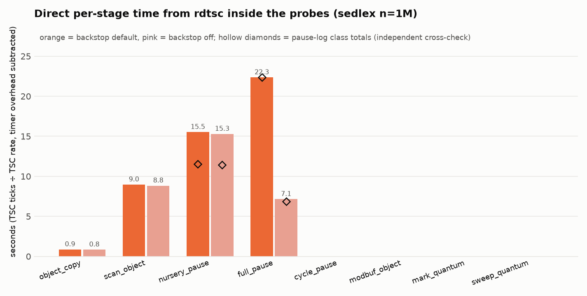

# sedlex under Bactrian: three discriminating experiments

Church, dual Xeon Gold 5120, runs pinned to one socket, `MMTK_THREADS=1`,
Bactrian at a pinned 8 GiB heap unless noted, vanilla at `o=500`. Binaries:
`~/shape/macro/{mmtk,vanilla}/sedlex/sedlex_bench.exe` (fix-branch build of
2026-08-30) and a probed build (`mmtk-probe3`) carrying the counters and
busy-wait hooks described in §5. Perf counters were locked (`paranoid=4`), so
every number is wall-clock, `MMTK_VERBOSE`, `MMTK_PAUSE_LOG`, `Gc.stat`, or
OCaml runtime events (`olly trace`). Reproduce with `sedlex_experiments.sh`;
charts with `sedlex_charts.py` (see §7).

## 0. Question and answer

Is sedlex's ~6x slowdown a remembered-set cost, a promotion (minor-to-major
copy) cost, or something else?

**Not the remembered set — it is empty.** Bactrian's per-GC remset counters
read `modbuf_objs=0`, `satb_nodes=0` at every nursery collection, and a
constant 1940 region entries over the entire run at every n and nursery size;
vanilla's `minor_remembered_set` phase totals 1–3 ms across n = 0.5M–2M.
sedlex is pure functional consing (young → old pointers), which the barrier
never logs.

**Promotion is real, and it is a quarter of the gap — and within it the copy
itself is ~10%: the per-object tracing path around the copy is the cost (§4a).** The dominant term (61%) is eleven cadence-triggered full re-marks
of a growing live set: a pacing law, not a copy cost. Mutator is the rest.

| component (n=1M) | vanilla | Bactrian | share of the 35.6 s gap |
|---|---:|---:|---:|
| promotion (vanilla `minor_local_roots_promote` / Bactrian nursery pauses) | 2.08 s | 11.55 s | 27% |
| major work (vanilla 3685 slices / Bactrian 11 monolithic fulls) | 0.56 s | 22.36 s | 61% |
| mutator | 4.31 s | ~8.8 s | 13% |
| wall | 7.09 s | 42.7 s | |


## 1. The workload

`sedlex_bench.ml` generates a ~480 MB pseudo-code string and tokenizes it into
ONE monotonically growing list of tens of millions of boxed tokens (most
holding a fresh `lexeme` string), then `List.rev`, `List.length`, `List.iter`.
Nothing dies young; the live set only grows; there are no mutations of old
objects. It is the canonical generational-hypothesis violator.

## 2. Experiment A — nursery-size sweep (long-lived vs short-lived)

Prediction: a promotion-bound long-lived workload is nursery-size-invariant
(the copy volume is the live set, whatever the nursery), while a short-lived
workload speeds up with a bigger nursery (more objects die before promotion).


All five series share one axis with wall time in seconds on a log scale, so
equal ratios are equal vertical distances and both workloads keep their true
shape (colour = runtime, line style = workload). The two short-lived (dashed)
binarytrees series fall by 2.7x (Bactrian, 10.0 -> 3.7 s) and 1.35x (vanilla,
3.9 -> 2.9 s) by 64 MB; vanilla sedlex is flat at 7.1 s; Bactrian sedlex with
the backstop off moves only 30 -> 22 s over a 128x range of nursery sizes. The
default Bactrian sedlex line's spike to 45.6 s at 8 MB is the
sliced-to-monolithic regime switch (7 -> 11 fulls), i.e. pacing, and
disappears with the backstop off.

sedlex n=1M, wall (s):

| nursery | 2 MB | 4 MB | 8 MB | 16 MB | 64 MB | 256 MB |
|---|---:|---:|---:|---:|---:|---:|
| vanilla (`s=`) | 7.1 | 7.1 | 7.1 | 7.1 | 7.1 | 7.1 |
| Bactrian, backstop off | 30.2 | 28.1 | 31.3 | 26.8 | 21.4 | 22.6 |
| Bactrian, default | 31.3 | 29.2 | 45.6 | 41.2 | 35.7 | 30.3 |

Bactrian's copy volume is invariant (62–63.5M objects at every nursery). The
backstop-off row is flat within the fixed per-pause overhead; the default row's
8 MB spike is the sliced→monolithic regime switch (7 → 11 fulls), i.e. pacing.

binarytrees n=20 (control), wall (s) and objects copied / promoted words:

| nursery | 2 MB | 4 MB | 8 MB | 16 MB | 64 MB |
|---|---:|---:|---:|---:|---:|
| Bactrian | 10.0 (40.2M) | 9.8 (37.4M) | 6.8 (25.0M) | 5.8 (19.9M) | 3.7 (4.4M) |
| vanilla | 3.9 (137M w) | 3.6 (115M w) | 3.3 (91M w) | 3.3 (72M w) | 2.9 (26M w) |

The control behaves exactly as a short-lived workload should on both runtimes.
sedlex does not. This is the promotion-bound signature.

## 3. Experiment B — remembered-set size vs n and vs nursery size

Probed build, `MMTK_REMSET_DEBUG=1`, one line per GC:

| n | nursery | nursery GCs | modbuf objects (total) | region entries (total) | SATB nodes |
|---|---|---:|---:|---:|---:|
| 0.5M | 2 / 16 / 256 MB | 2448 / 252 / 20 | 0 / 0 / 0 | 1940 / 1940 / 1940 | 0 |
| 1M | 2 / 16 / 256 MB | 4920 / 502 / 39 | 0 / 0 / 0 | 1940 / 1940 / 1940 | 0 |
| 2M | 2 / 16 / 256 MB | 9959 / 1010 / 73 | 0 / 0 / 0 | 1940 / 1941 / 1940 | 0 / 1 / 0 |

The remembered set does not grow with n, does not depend on nursery size, and
is four to five orders of magnitude below the objects promoted (31.4M / 63.5M / 127.4M in total at 0.5M / 1M / 2M, i.e. 65K–10.7M per GC depending on nursery).
The 1940 region entries are the `Buffer` used to build the input, written
once. Vanilla agrees: `minor_remembered_set` 0.001 / 0.002 / 0.003 s at
0.5M / 1M / 2M against 1.09 / 2.07 / 4.38 s of promotion.


## 4. Experiment C — per-stage cost measured directly, and stage coloring

### 4a. Direct per-stage cycles (rdtsc inside the probes)

The probed build times every stage invocation with `rdtsc` (constant-rate
TSC, 2.195 GHz on this Xeon; the timer's own cost, 89 ticks per begin/end
pair, is calibrated at startup and subtracted). Per-stage totals are
accumulated in the collector and printed at exit under `MMTK_STAGE_CYCLES=1`.
Nothing here is derived from wall time or from the pause log; the pause-log
class totals appear only as an independent cross-check. Nesting: `scan_object`
times the whole per-object path in the drain (scan the object, trace each
slot, write back), which *contains* the `object_copy` timer (the copy itself
plus the forwarding-pointer install); the pause timers (`prepare` →
`end_of_gc`) contain everything.



n=1M, backstop default (backstop off in parentheses):

| stage | invocations | corrected ticks / call | seconds | pause-log cross-check |
|---|---:|---:|---:|---:|
| `full_pause` | 10 (3) | 4.9 G (5.2 G) | **22.35** (7.15) | 22.36 (6.85) |
| `nursery_pause` | 490 (490) | 69.5 M = 31.6 ms | **15.52** (15.29) | 11.55 (11.42)† |
| `scan_object` — per-object trace path, includes copy | 63.46M | **310** (306) | 8.97 (8.83) | — |
| `object_copy` — copy + forwarding install only | 63.47M | **30** (29) | 0.87 (0.84) | — |
| `cycle_pause` / `mark_quantum` / `sweep_quantum` / `modbuf_object` | 2 / 2 / 1 / 0 | — | ≈0 | — |

† the pause log records the STW window; the `prepare`→`end_of_gc` timer also
covers the pre-/post-pause work the plan does around it (nursery reset, release,
bookkeeping), which is why the direct figure is the larger of the two.

Three things this establishes, none of which the wall-time attribution could:

1. **The full re-marks are 22.35 s by direct count.** The pause log's 22.36 s
   is now a confirmation, not an input.
2. **Inside promotion, the copy itself is ~10%.** Copy + forwarding costs
   30 ticks (~14 ns) per object. The other ~280 ticks per object are the
   scan-and-trace machinery around it: reading each slot, `trace_object`
   dispatch, forwarding and mark-bit checks, the slot write-back. The cost is
   the per-object *tracing path*, not the memcpy.
3. **~42% of nursery-pause time is outside the per-object loop**: 15.5 s of
   pauses vs 9.0 s of per-object work leaves ~6.5 s, i.e. ~13 ms of fixed
   cost per pause (root scanning, nursery reset, pause setup/teardown, worker
   hand-off). That is what a larger nursery amortises — the 256 MB nursery's
   −30% in §5 is this term.

For comparison, vanilla's own per-phase timer (runtime events,
`minor_local_roots_promote`) puts its promotion of the same 63.5M objects at
2.08 s, i.e. ~33 ns or ~72 TSC ticks per object, against Bactrian's 310 on the
per-object path — about 4.3x per object, before Bactrian's ~13 ms per-pause
fixed cost is counted.

At n=2M the per-object trace cost creeps from 310 to 326 ticks as the heap
grows (cache), and the per-full cost from 2.2 s to 3.2 s with the live set;
the structure is unchanged.

### 4b. Stage coloring by busy-wait injection (independent invocation counts)

`MMTK_SPIN_STAGE=<stage> MMTK_SPIN_NS=<ns>` spins for `ns` at every
invocation of one stage and nothing else. If a stage runs N times, adding d
seconds per invocation adds N·d to wall time, whatever the stage itself costs.
So the slope of wall time against the injected delay is the invocation count
N, obtained without any timer in the collector.

What this can and cannot establish. Coloring measures *how often* a stage
runs, not *how long* it runs: the shift is N·d whether the stage's own cost
is 10 ns or 10 s. Turning N into seconds needs the per-invocation cost, and
that is exactly the quantity §4a measures directly with `rdtsc`. (An earlier
draft divided the pause-log totals by N to get a "cost per invocation"; that
uses the wall-time attribution to prove itself and was dropped.) So the
ranking of stages comes from §4a; coloring's job is to confirm, by a method
that shares nothing with the probes, the counts that §4a's totals rest on.

The raw comparison, n=1M, backstop default (the backstop-off series is in
`results/coloring2.txt` and `results/coloring_objcopy.txt`). "No injection"
is the same binary with `MMTK_SPIN_STAGE` unset, run in the same batch;
run-to-run noise on this workload is about ±1 s.

| stage | delay per call | wall, no injection | wall, with injection | Δ | N = Δ/delay | N, slope fit | probe counter |
|---|---:|---:|---:|---:|---:|---:|---:|
| `nursery_pause` | 10 ms | 42.29 s | 44.82 s | +2.53 s | 253 | 485 | 490 |
| | 20 ms | | 49.36 s | +7.07 s | 354 | | |
| | 40 ms | | 59.32 s | +17.03 s | 426 | | |
| `full_pause` | 0.5 s | 42.29 s | 47.42 s | +5.13 s | 10.3 | 10 | 10 |
| | 1.0 s | | 52.51 s | +10.22 s | 10.2 | | |
| `cycle_pause` | 0.5 s | 42.29 s | 43.45 s | +1.16 s | 2.3 | 2 | 2 |
| `scan_object` | 100 ns | 42.29 s | 50.41 s | +8.12 s | 81 M | 60.7 M | 63.5 M |
| | 200 ns | | 59.13 s | +16.84 s | 84 M | | |
| | 400 ns | | 69.14 s | +26.85 s | 67 M | | |
| `object_copy` | 100 ns | 42.87 s | 51.23 s | +8.36 s | 84 M | 66.2 M | 63.5 M |
| | 200 ns | | 58.87 s | +16.00 s | 80 M | | |
| | 400 ns | | 71.28 s | +28.41 s | 71 M | | |
| `mark_quantum` | 1 ms / 4 ms | 42.29 s | 42.65 / 43.37 s | +0.36 / +1.08 s | within noise | ≈0 | 2 |
| `sweep_quantum` | 1 ms / 4 ms | 42.29 s | 42.88 / 40.79 s | +0.59 / −1.50 s | within noise | ≈0 | 1 |
| `modbuf_object` | 1 ms | 42.29 s | 42.84 s | +0.55 s | within noise | ≈0 | 0 |

Reading it: the per-point ratio Δ/delay is biased when Δ is close to the
±1 s noise floor (the 10 ms nursery point) and, for the sub-microsecond
stages, by the spin loop's own ~30–50 ns entry cost, which the slope between
adjacent points removes: between the 20 ms and 40 ms nursery points the
slope is 498 (probe: 490); between the two full-pause points 10.2 (probe:
10). The fitted N agrees with the probe counters within 1% for pauses and
within ~5–10% for the ~63 M per-object stages. The stages the counters say
never run (`modbuf_object`, the quanta) show no slope at all.

Combined with §4a this closes the loop: the counts are right by two
independent methods, and the per-invocation costs are measured directly, so
the stage totals (full re-marks 22.35 s, nursery pauses 15.5 s of which
9.0 s is the per-object trace and 0.87 s the copy, everything else ≈0) are
not inferred from wall time anywhere.


## 5. What moves the number (measured, n=1M)

Full pacing diagnosis (trigger trace, cadence and margin-law sweeps, stacked
knobs, CLBG spot-check) in
[PACING-DIAGNOSIS.md](PACING-DIAGNOSIS.md).

| change | wall | vs vanilla | mechanism |
|---|---:|---:|---|
| default | 42.7 s | 6.0x | |
| `MMTK_FULL_GC_CADENCE=100000` (bytes backstop off) | 26.8 s | 3.8x | fulls 11 → 4 |
| + nursery 256 MB + UP-oldify | 20.1 s | 2.72x | fewer pauses, plain-op copy |
| Immix (non-moving), `overhead=500` | 8.1 s | 1.16x | copies nothing; 3–4x RSS |

The bytes backstop (`collection.rs`, a full every 512 MiB of nursery
allocation, blind to survivors and headroom) is the pacer: `MMTK_PACE_DEBUG`
shows 10/11 fulls `by_cadence`; the margin law (`MMTK_MATURE_OVERHEAD_PCT`
100–1000%) leaves the count at 11. Disabling it also makes binarytrees faster
(5.32 → 4.88 s, 13 → 8 fulls, RSS unchanged) at a pinned heap; the
dynamic-heap case is unchecked. Beyond pacing, the promotion copy itself is
the architectural cost; StickyImmix (in-place young marking) is the fix and
currently panics under the native binding (`epilogue.rs:11`).

### Landed: the slicing gate rework (mmtk-core 50f56f5987, binding e4af0d336)

The old feasibility gate (`MMTK_SLICE_MAX_NURSERY_MB`=4, `MMTK_MAX_QUANTUM_MS`=50,
plus a redundant 200 ms quantum ceiling) is replaced by two measured tests:
slice iff the monolithic Full would be too long (`debt_ms` = live / mark-rate
> `MMTK_SLICE_WORTH_MS`, default 200) AND the sliced pause would fit
(nursery-pause EWMA + quantum <= `MMTK_SLICE_MAX_PAUSE_MS`, default 100).
`MMTK_PACE_DEBUG` prints each decision.

| bench (1 worker) | before | after |
|---|---|---|
| sedlex 1M, 8 GiB | 40.7 s, 11 fulls, max pause 6.3 s, GC 32.5 s | **22.6 s**, 6 fulls, max pause **1.4 s**, GC 14.2 s |
| sedlex 2M, 8 GiB | 80.5 s, 15 fulls, max pause 10.9 s | **42.4 s**, 8 fulls, max pause **1.1 s** |
| binarytrees n16, 192 MiB | 5.76 s, 13 fulls, max 118 ms | 5.59 s, 13 fulls, max 114 ms (unchanged; debt never exceeds ~28 ms) |

Full 11-bench quick panel, before vs after, 3 reps: wall geomean 0.993 (T=1)
and 0.989 (T=4), RSS unchanged, GC/full counts identical, pause maxima within
noise, golden outputs 33/33 in all four batteries. No CLBG bench reaches a
200 ms Full estimate, so the panel takes the old path exactly; only
large-live-set workloads take the new one. Residual: sedlex's max pause is
~1.1-1.4 s, not tens of ms -- a few early cycles the gate judged short
(debt < 200 ms at the default 1 MB/ms mark rate) ran longer; a lower
`MMTK_SLICE_WORTH_MS` is the tuning follow-up.

## 6. Reproducing

```
scp sedlex_experiments.sh trace_split.py church:shape/
ssh church 'CORES=0-13 bash ~/shape/sedlex_experiments.sh ~/shape/sedlex/results'
scp -r church:shape/sedlex/results ./results && python3 sedlex_charts.py results charts
```
Env overrides: `MMTK_SEDLEX`, `MMTK_SEDLEX_PROBE`, `VAN_SEDLEX`, `MMTK_BT`,
`VAN_BT`, `OLLY`, `CORES`; stages ⊆ {nursery, control, remset, coloring,
cycles, vanilla}. The probed build is the `sedlex-probe` branch of the
`mmtk-inst` tree's `gc/mmtk-core` (`src/util/probe.rs` + the hook lines it
documents): `MMTK_REMSET_DEBUG=1` prints per-GC remset counters,
`MMTK_SPIN_STAGE`/`MMTK_SPIN_NS` inject the coloring delays, and
`MMTK_STAGE_CYCLES=1` prints the direct per-stage rdtsc totals. Not for merging.
