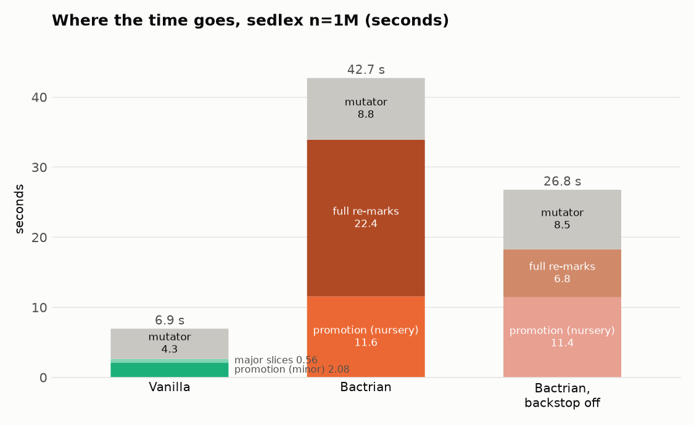
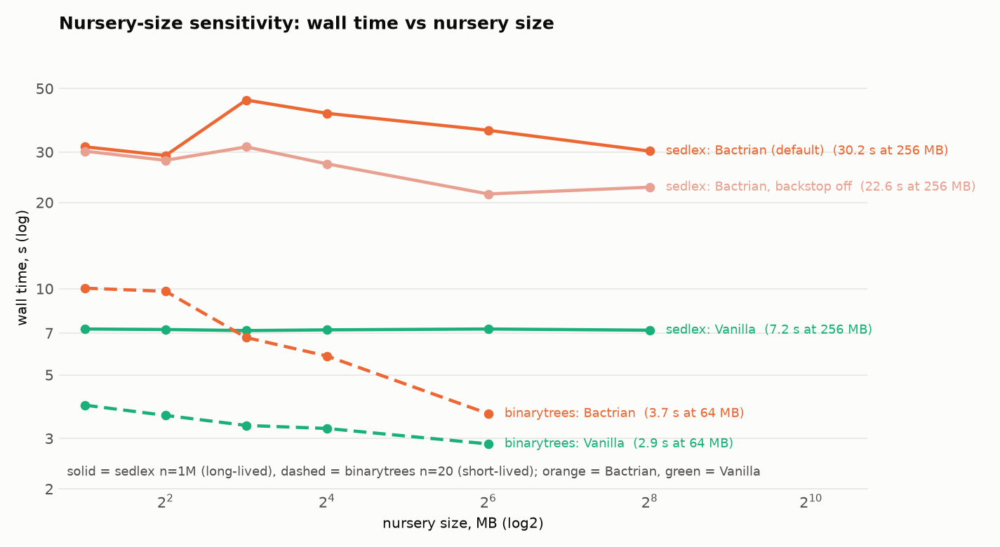
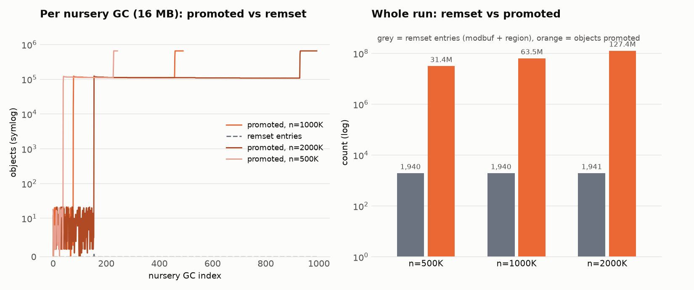
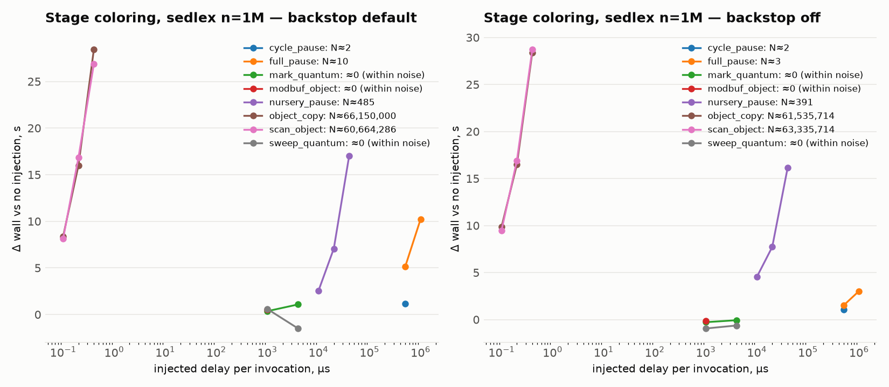

# sedlex under Bactrian: three discriminating experiments

Church, dual Xeon Gold 5120, runs pinned to one socket, `MMTK_THREADS=1`,
Bactrian at a pinned 8 GiB heap unless noted, vanilla at `o=500`. Binaries:
`~/shape/macro/{mmtk,vanilla}/sedlex/sedlex_bench.exe` (fix-branch build of
2026-08-30) and a probed build (`mmtk-probe3`) carrying the counters and
busy-wait hooks described in §5. Perf counters were locked (`paranoid=4`), so
every number is wall-clock, `MMTK_VERBOSE`, `MMTK_PAUSE_LOG`, `Gc.stat`, or
OCaml runtime events (`olly trace`). Reproduce with `sedlex_experiments.sh`;
charts with `sedlex_charts.py` (see §7).

## 0. Question and answer

Is sedlex's ~6x slowdown a remembered-set cost, a promotion (minor-to-major
copy) cost, or something else?

**Not the remembered set — it is empty.** Bactrian's per-GC remset counters
read `modbuf_objs=0`, `satb_nodes=0` at every nursery collection, and a
constant 1940 region entries over the entire run at every n and nursery size;
vanilla's `minor_remembered_set` phase totals 1–3 ms across n = 0.5M–2M.
sedlex is pure functional consing (young → old pointers), which the barrier
never logs.

**Promotion is real, and its per-KB cost is 5.6x vanilla — but it is a quarter
of the gap.** The dominant term (61%) is eleven cadence-triggered full re-marks
of a growing live set: a pacing law, not a copy cost. Mutator is the rest.

| component (n=1M) | vanilla | Bactrian | share of the 35.6 s gap |
|---|---:|---:|---:|
| promotion (vanilla `minor_local_roots_promote` / Bactrian nursery pauses) | 2.08 s | 11.55 s | 27% |
| major work (vanilla 3685 slices / Bactrian 11 monolithic fulls) | 0.56 s | 22.36 s | 61% |
| mutator | 4.31 s | ~8.8 s | 13% |
| wall | 7.09 s | 42.7 s | |



## 1. The workload

`sedlex_bench.ml` generates a ~480 MB pseudo-code string and tokenizes it into
ONE monotonically growing list of tens of millions of boxed tokens (most
holding a fresh `lexeme` string), then `List.rev`, `List.length`, `List.iter`.
Nothing dies young; the live set only grows; there are no mutations of old
objects. It is the canonical generational-hypothesis violator.

## 2. Experiment A — nursery-size sweep (long-lived vs short-lived)

Prediction: a promotion-bound long-lived workload is nursery-size-invariant
(the copy volume is the live set, whatever the nursery), while a short-lived
workload speeds up with a bigger nursery (more objects die before promotion).



All five series share one axis with wall time in seconds on a log scale, so
equal ratios are equal vertical distances and both workloads keep their true
shape (colour = runtime, line style = workload). The two short-lived (dashed)
binarytrees series fall by 2.7x (Bactrian, 10.0 -> 3.7 s) and 1.35x (vanilla,
3.9 -> 2.9 s) by 64 MB; vanilla sedlex is flat at 7.1 s; Bactrian sedlex with
the backstop off moves only 30 -> 22 s over a 128x range of nursery sizes. The
default Bactrian sedlex line's spike to 45.6 s at 8 MB is the
sliced-to-monolithic regime switch (7 -> 11 fulls), i.e. pacing, and
disappears with the backstop off.

sedlex n=1M, wall (s):

| nursery | 2 MB | 4 MB | 8 MB | 16 MB | 64 MB | 256 MB |
|---|---:|---:|---:|---:|---:|---:|
| vanilla (`s=`) | 7.1 | 7.1 | 7.1 | 7.1 | 7.1 | 7.1 |
| Bactrian, backstop off | 30.2 | 28.1 | 31.3 | 26.8 | 21.4 | 22.6 |
| Bactrian, default | 31.3 | 29.2 | 45.6 | 41.2 | 35.7 | 30.3 |

Bactrian's copy volume is invariant (62–63.5M objects at every nursery). The
backstop-off row is flat within the fixed per-pause overhead; the default row's
8 MB spike is the sliced→monolithic regime switch (7 → 11 fulls), i.e. pacing.

binarytrees n=20 (control), wall (s) and objects copied / promoted words:

| nursery | 2 MB | 4 MB | 8 MB | 16 MB | 64 MB |
|---|---:|---:|---:|---:|---:|
| Bactrian | 10.0 (40.2M) | 9.8 (37.4M) | 6.8 (25.0M) | 5.8 (19.9M) | 3.7 (4.4M) |
| vanilla | 3.9 (137M w) | 3.6 (115M w) | 3.3 (91M w) | 3.3 (72M w) | 2.9 (26M w) |

The control behaves exactly as a short-lived workload should on both runtimes.
sedlex does not. This is the promotion-bound signature.

## 3. Experiment B — remembered-set size vs n and vs nursery size

Probed build, `MMTK_REMSET_DEBUG=1`, one line per GC:

| n | nursery | nursery GCs | modbuf objects (total) | region entries (total) | SATB nodes |
|---|---|---:|---:|---:|---:|
| 0.5M | 2 / 16 / 256 MB | 2448 / 252 / 20 | 0 / 0 / 0 | 1940 / 1940 / 1940 | 0 |
| 1M | 2 / 16 / 256 MB | 4920 / 502 / 39 | 0 / 0 / 0 | 1940 / 1940 / 1940 | 0 |
| 2M | 2 / 16 / 256 MB | 9959 / 1010 / 73 | 0 / 0 / 0 | 1940 / 1941 / 1940 | 0 / 1 / 0 |

The remembered set does not grow with n, does not depend on nursery size, and
is four to five orders of magnitude below the objects promoted (31.4M / 63.5M / 127.4M in total at 0.5M / 1M / 2M, i.e. 65K–10.7M per GC depending on nursery).
The 1940 region entries are the `Buffer` used to build the input, written
once. Vanilla agrees: `minor_remembered_set` 0.001 / 0.002 / 0.003 s at
0.5M / 1M / 2M against 1.09 / 2.07 / 4.38 s of promotion.



## 4. Experiment C — stage coloring by busy-wait injection

Probed build: `MMTK_SPIN_STAGE=<stage> MMTK_SPIN_NS=<ns>` spins for `ns` at
every invocation of one stage. Wall increase is linear in the delay with slope
= invocation count N, independent of what the stage itself costs; combined
with the pause-class durations this gives natural per-invocation cost.
Stages: `nursery_pause`, `full_pause`, `cycle_pause` (InitialMark/FinalMark),
`object_copy` (every promoted object, hooked in `object_forwarding::forward_object`), `modbuf_object`
(every remembered object), `scan_object` (every object scanned in the UP
drain), `mark_quantum`, `sweep_quantum`.



Fitted invocation counts N (slope of Δwall against injected delay, three
delays per stage), the count the pause log / probe counters give
independently, and the natural per-invocation cost (pause-class pool ÷ N):

| stage | N, backstop default | log / counter | N, backstop off | log / counter | natural cost |
|---|---:|---:|---:|---:|---:|
| `nursery_pause` | 485 | 491 | 391* | 491 | 23.8 ms / pause |
| `object_copy` | 66.2M | 63.4M copied | 61.5M | 63.4M | } 175–186 ns per promoted object |
| `scan_object` | 60.7M | 63.4M scanned | 63.3M | 63.4M | } (copy + scan + slot processing, same pool) |
| `full_pause` | 10 | 11 | 3 | 4 | 2.2 s / full re-mark |
| `cycle_pause` | 2 | 3 (startup) | 2 | 3 | part of the full pool |
| `modbuf_object` | ≈0 | 0 | ≈0 | 0 | — |
| `mark_quantum` | ≈0 | few | ≈0 | few | — |
| `sweep_quantum` | ≈0 | few | ≈0 | few | — |

\* the 10 ms point of the backstop-off series sits inside the ~1 s
run-to-run noise; the 40 ms point alone gives 403.

Reading: the busy-wait injection recovers the same structure the pause logs
and counters describe, from the timing side. Exactly two stages carry the GC
time — the per-object promotion path (~63M invocations at ~180 ns, i.e. the
~546 cycles/object of §4; `object_copy` and `scan_object` are the same objects
seen twice, so their costs are not additive) and the full re-marks (11 at
~2.2 s each; 4 with the backstop off). The remembered-set stage has zero
invocations, and the mark/sweep quanta are too few and too cheap to register.
Nothing else in the collector is on the critical path for this workload.

## 5. What moves the number (measured, n=1M)

Full pacing diagnosis (trigger trace, cadence and margin-law sweeps, stacked
knobs, CLBG spot-check) in
[PACING-DIAGNOSIS.md](PACING-DIAGNOSIS.md).

| change | wall | vs vanilla | mechanism |
|---|---:|---:|---|
| default | 42.7 s | 6.0x | |
| `MMTK_FULL_GC_CADENCE=100000` (bytes backstop off) | 26.8 s | 3.8x | fulls 11 → 4 |
| + nursery 256 MB + UP-oldify | 20.1 s | 2.72x | fewer pauses, plain-op copy |
| Immix (non-moving), `overhead=500` | 8.1 s | 1.16x | copies nothing; 3–4x RSS |

The bytes backstop (`collection.rs`, a full every 512 MiB of nursery
allocation, blind to survivors and headroom) is the pacer: `MMTK_PACE_DEBUG`
shows 10/11 fulls `by_cadence`; the margin law (`MMTK_MATURE_OVERHEAD_PCT`
100–1000%) leaves the count at 11. Disabling it also makes binarytrees faster
(5.32 → 4.88 s, 13 → 8 fulls, RSS unchanged) at a pinned heap; the
dynamic-heap case is unchecked. Beyond pacing, the promotion copy itself is
the architectural cost; StickyImmix (in-place young marking) is the fix and
currently panics under the native binding (`epilogue.rs:11`).

## 6. Reproducing

```
scp sedlex_experiments.sh trace_split.py church:shape/
ssh church 'CORES=0-13 bash ~/shape/sedlex_experiments.sh ~/shape/sedlex/results'
scp -r church:shape/sedlex/results ./results && python3 sedlex_charts.py results charts
```
Env overrides: `MMTK_SEDLEX`, `MMTK_SEDLEX_PROBE`, `VAN_SEDLEX`, `MMTK_BT`,
`VAN_BT`, `OLLY`, `CORES`; stages ⊆ {nursery, control, remset, coloring,
vanilla}. The probed build is the `sedlex-probe` branch of the `mmtk-inst`
tree's `gc/mmtk-core` (`src/util/probe.rs` + 9 hook lines), not for merging.
